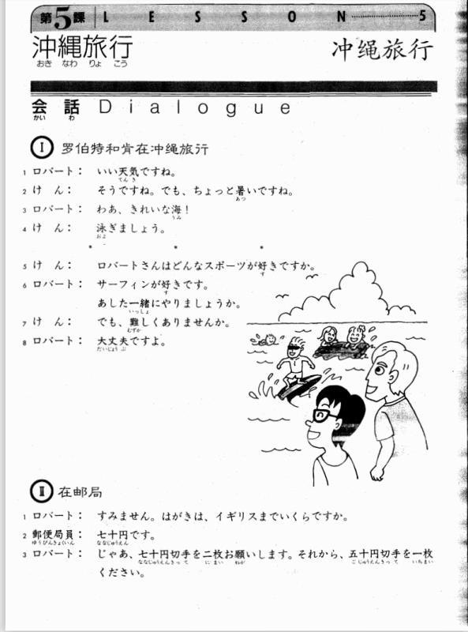
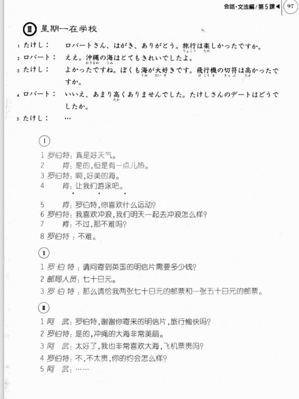

**[[ ../Menu.md | Home ]]**

## 第5课　沖縄旅行・冲绳旅行
**罗伯特和肯在冲绳旅行**
**ロバート：真是好天气。**
いい天気ですね。

**けん：是的，但是有一点热。**
そうですね。でも、ちょっと暑いですね。

**ロバート：啊，好美的海。**
わあ、きれいな海！

**けん：让我们游泳吧。**
泳ぎましょう。

**けん：罗伯特，你喜欢什么运动？**
ロバートさんはどんなスポーツが好きですか。

**ロバート：我喜欢冲浪，我们明天一起去冲浪怎么样？**
サーフィンが好きです。明日一緒にやりましょうか。

**けん：不过，那不难吗？**
でも、難しくありませんが。

**ロバート：不难。**
大丈夫ですよ。

**在邮局**
**ロバート：请问寄到英国的明信片需要多少钱？**
すみません。はがきは、イギリスまでいくらですか。

**郵便局員： 70日元。**
七十円です

**ロバート： 那么请给我两张，70日元的邮票和一张50日元的邮票。**
じゃあ、七十円切手を二枚お願いします。それから、五十円切手を一枚ください。

**星期一在学校**
**たけし：罗伯特，谢谢你寄来的明信片。旅行愉快吗？**
ロバートさん、はがき、ありがとう。旅行は楽しかったですか。

**ロバート：是的。冲绳的大海非常美丽。**
ええ。沖縄の海はとても綺麗ですたよ。

**たけし：太好了，我也非常喜欢大海，机票贵吗？**
よかったですね。僕も海が大好きです。飛行機の切符は高かったですか。

**ロバート：不，不太贵，你的约会怎么样？**
いいえ。あまり高くありませんでした。たけしさんのデートはどうでしたか。

**たけし：…**
...

---
