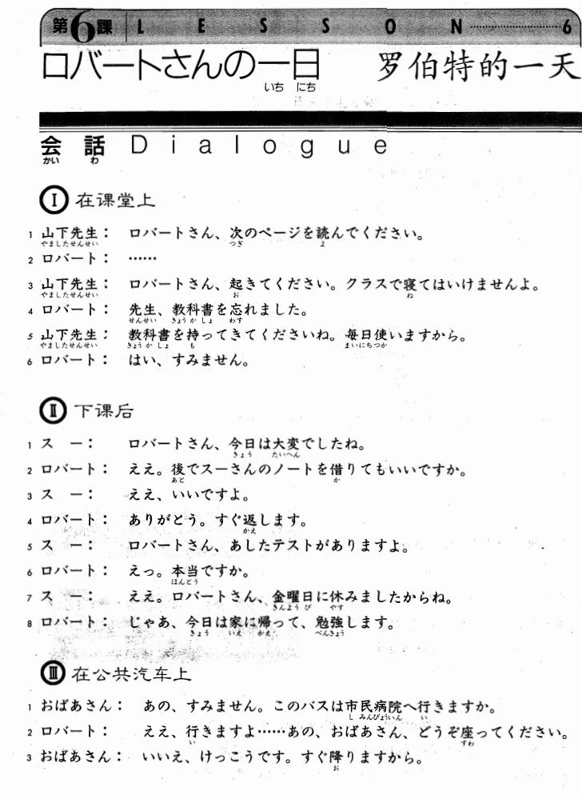

**[[ ../Menu.md | Home ]]**

## 第6课　ロバートさんの一日・罗伯特的一天
**在课堂上**
**山下先生：罗伯特，请读下一页。**
ロバートさん、次のページを読んでください。

**ロバート：...**
...

**山下先生：罗伯特，醒一醒，不能在课堂上睡觉。**
ロバートさん、起きてください。クラスで寝てはいけませんよ。

**ロバート：老师，我忘了带教科书。**
先生、教科書を忘れました。

**山下先生：请带教科书来上课，因为我们每天都要用。**
教科書を持ってきてくださいね。毎日使いますから。

**ロバート：我知道了，对不起。**
はい、すみません。

**下课后**
**スー：罗伯特，你今天真是太糟糕了。**
ロバートさん、今日は大変でしたね。

**ロバート：是的，我能借你的笔记吗？**
ええ。後でスーさんのノートを借りてもいいですか

**スー：当然。**
ええ、いいですよ。

**ロバート：谢谢，我很快会还给你的。**
ありがとう。すぐ返します。

**スー：罗伯特，我们明天有考试。**
ロバートさん、明日テストがありますよ。

**ロバート：真的？**
えっ。本当ですか。

**スー：是的，因为上星期五你没上课。**
ええ。ロバートさん、金曜日に休みましたから。

**ロバート：那么，今天我回家以后好好学习。**
じゃあ、今日は家に帰って、勉強します。

**在公共汽车上**
**おばあさん：请问这是去市区医院的公共汽车吗？**
あの、すみません。このバスは市民病院へ行きますか。

**ロバート：是的，请坐这里，大娘。**
ええ。行きますよ......あの、おばあさん、どうぞ座ってください。

**おばあさん：不，谢谢，我很快就下车。**
いいえ。結構です。すぐ降りますから。

**ロバート：是吗？那我帮你拿行李吧。**
そうですか。じゃあ、荷物を持ちましょうか。

**おばあさん：谢谢。**
あ、どうもすみません。

---
