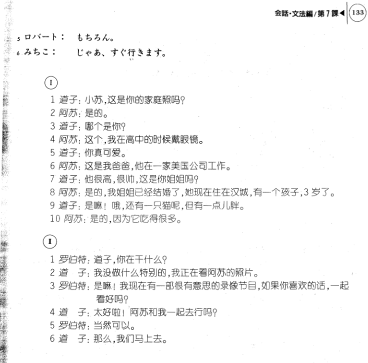

**[[ ../Menu.md | Home ]]**

## 第7课　家族の写真・家庭照片
**阿苏正把她家的相片给室友道子看**
**みちこ：小苏，这是你的家庭照吗？**
これはスーさんの家族の写真ですか。

**ス一：是的。**
ええ。

**みちこ：哪个是你?**
スーさんはどれですか。

**スー：这个，我在高中的时候戴眼镜。**
これです。高校の時はめがねをかけていました。

**みちこ：你真可爱。**
かわいいですね。

**ス一：这是我爸爸，他在一家美国公司工作。**
これは父です。アメリカの会社に勤めています。

**みちこ：他很高，很帅，这是你姐姐吗？**
背が高くて、ハンサムですね。これはお姉さんですか。

**スー：是的，我姐姐已经结婚了，她现在住在汉城，有一个孩子，3岁了。**
ええ。姉は結婚しています。今ソウルに住んでいます。子供が一人います。三歳です。

**みちこ：是嘛！哦，还有一只猫呢，但有一点儿胖。**
そうですか。あっ、猫がいますね。でも、ちょっと太っていますね。

**ス一：是的，因为它吃得很多。**
ええ、よく食べますから。

**阿苏和道子的房间电话响了**
**ロバート：道子，你在干什么？**
みちこさん、今何をしていますか。

**みちこ：我没做什么特别的，我正在看阿苏的照片。**
別に何もしていません。今、スーさんの写真を見ています。

**ロバート：是嘛！我现在有一部很有意思的录像节目，如果你喜欢的话，一起看好吗？**
そうですか。おもしろいビデオがありますから、よかったら見に来ませんか。

**みちこ：太好啦！阿苏和我一起去行吗？**
いいですね。スーさんも一緒に行ってもいいですか。

**ロバート：当然可以。**
もちろん。

**みちこ：那么，我们马上去。**
じゃあ、すぐ行きます。

---
