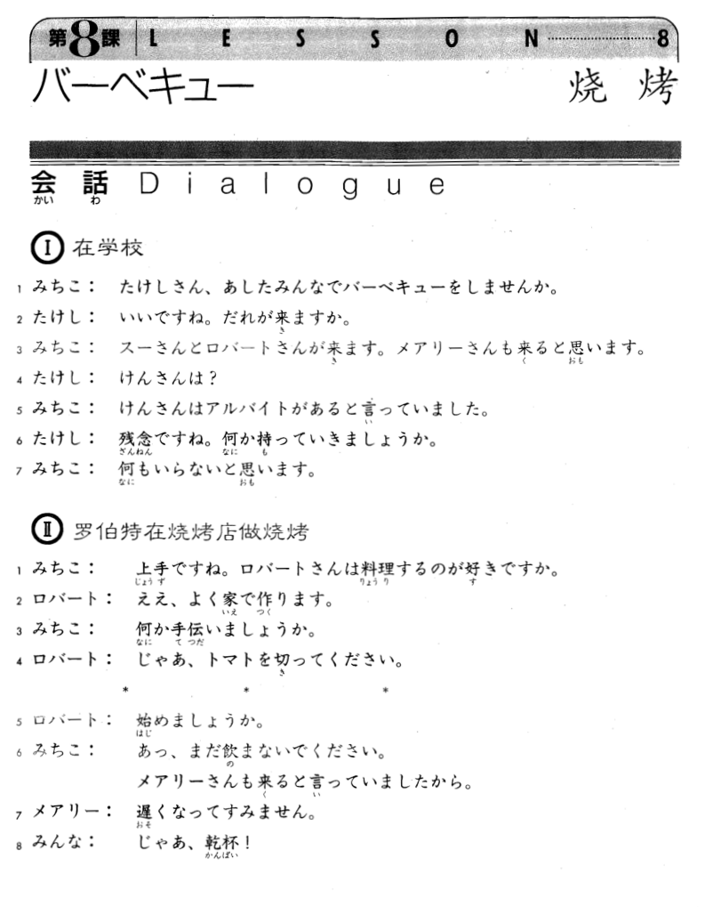
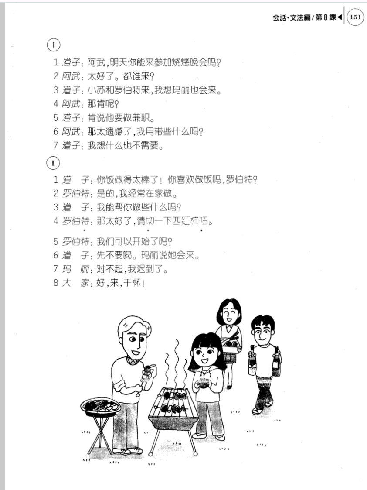

**[[ ../Menu.md | Home ]]**

## 第8课　バーベキュー・烧烤
**在学校**
**みちこ：阿武明天你能来参加烧烤晚会吗?**
たけしさん、あしたみんなでバーベキューをしませんか。

**たけし：太好了。都谁来?**
いいですね。誰が来ますか。

**みちこ：小苏和罗伯特来，我想玛丽也会来。**
スーさんとロバートさんが来ます。メアリーさんも来ると思います。

**たけし：那肯呢?**
けんさんは？

**みちこ：肯说他要做兼职。**
けんさんはアルバイトがあると言っていました。

**たけし：那太遗憾了，我用带些什么吗?**
残念ですね。何か持って行きましょうか。

**みちこ：我想什么也不需要。**
何もいらないと思います。

**罗伯特在烧烤店做烧烤**
**みちこ：你饭做得太棒了!你喜欢做饭吗，罗伯特?**
上手ですね。ロバートさんは料理するのが好きですか。

**ロバート：是的，我经常在家做。**
ええ、よく家で作ります。

**みちこ：我能帮你做些什么吗?**
何か手伝いましょうか。

**ロバート：那太好了，请切一下西红柿吧。**
じゃあ、トマトを切ったください。

**ロバート：我们可以开始了吗?**
始めましょうか。

**みちこ：先不要喝。玛丽说她会来。**
あっ、まだ飲まないでください。メアリーさんも来ると言っていましたから。

**メアリー：对不起，我迟到了。**
遅くなってすみません。

**みんな・：好，来，干杯!**
じゃあ、乾杯！

---
