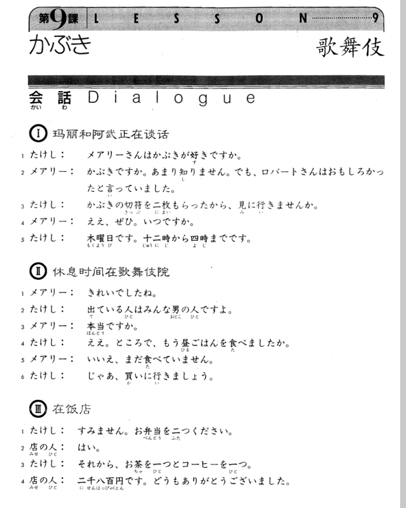
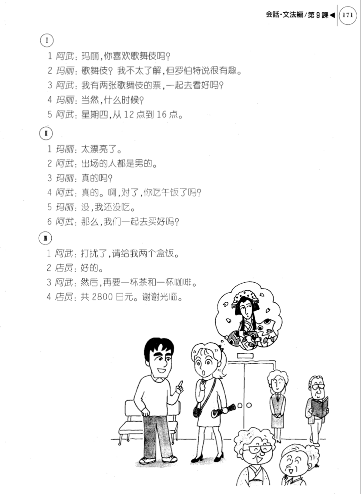

**[Home](../Menu.md)**

## 第9课　カブキ・歌舞伎
**玛丽和阿武正在对话**

たけし：玛丽，你喜欢歌舞伎吗?

メアリーさんはかぶきが好きですか。

メアリー：歌舞伎我不太了解，但罗伯特说很有趣。

かぶきですか。あまり知りません。でも、ロバートさんはおもしろかったといっていました。

たけし：我有两张歌舞伎的票，一起去看好吗?

かぶきの切っ符を二枚もらったから、見に行きませんか。

メアリー：当然，什么时候?

ええ、ぜひ。いつですか。

たけし：星期四，从12点到16点。

木曜日です。十二時から四時までです。

**休息时间在歌舞伎院**

メアリー：太漂亮了。

きれいでしたね。

たけし：出场的人都是男的。

出ている人はみんな男の人ですよ。

メアリー：真的吗?

本当ですか。

たけし：真的。啊，对了，你吃午饭了吗?

ええ。ところで、もう昼ごはんを食べましたか。

メアリー：没，我还没吃。

いいえ、まだ食べたいません。

たけし：那么，我们一起去买好吗?

じゃあ、買いに行きましょう。

**在饭店**

たけし：打扰了请给我两个盒饭。

すみません。お弁当を二つください。

店の人：好的。

はい。

たけし：然后再要一杯茶和一杯咖啡。

それから、お茶を一つとコーヒーを一つ。

店の人：共2800日元。谢谢光临。

二千八百円です。どうもありがとうございました。

---
