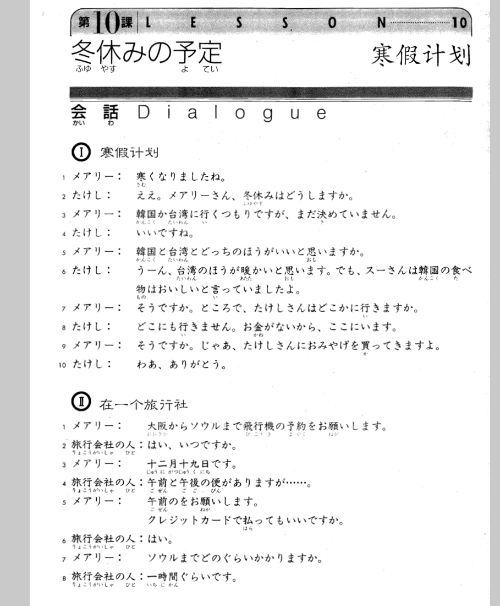
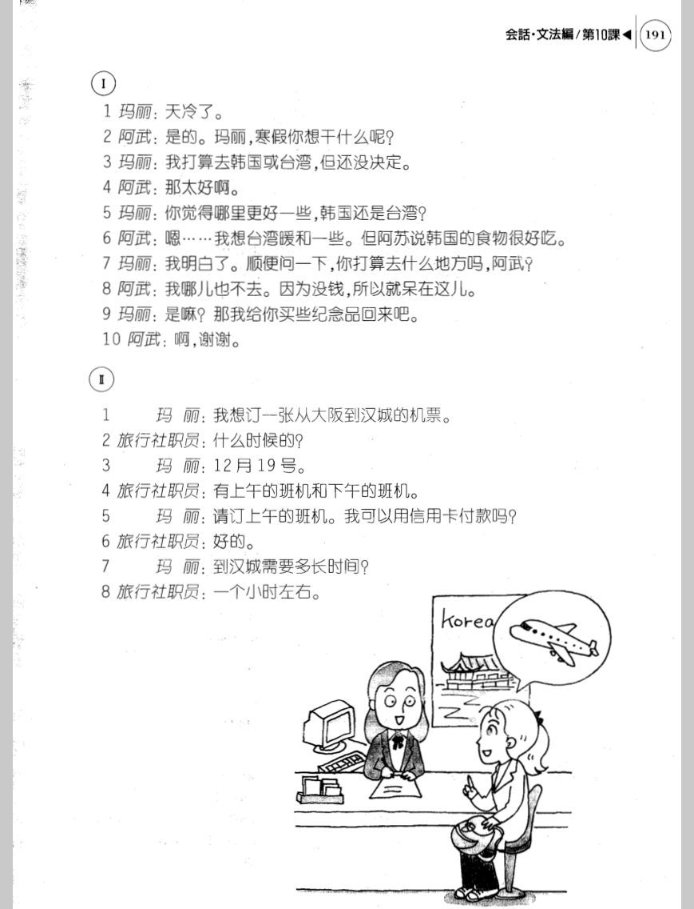

**[[ ../Menu.md | Home ]]**

## 第10课　冬休みの予定・寒假计划
**寒假计划**
**メアリー：天冷了。**
寒くなりましたね。

**たけし：是的。玛丽，寒假你想干什么呢？**
ええ。メアリーさん、冬休みはどうしますか。

**メアリー：我打算去韩国或台湾，但还没决定。**
韓国か台湾に行くつもりですが、まだ決めていません。

**たけし：那太好啊。**
いいですね。

**メアリー：你觉得哪里更好一些，韩国还是台湾？**
韓国と台湾とどっちのほうがいいと思いますか。

**たけし：嗯……我想台湾暖和一些。但阿苏说韩国的食物很好吃。**
うーん、台湾のほうが暖かいと思います。でも、スーさんは韓国の食べ物はおいしいと言っていましたよ。

**メアリー：我明白了。顺便问一下，你打算去什么地方吗，阿武？**
そうですか。ところで、たけしさんはどこかに行きますか。

**たけし：我哪儿也不去。因为没钱，所以就呆在这儿。**
どこにも行きません。お金がないから、ここにいます。

**メアリー：是嘛？那我给你买些纪念品回来吧。**
そうですか。じゃあ、たけしさんにおみやげを買ってきますよ。

**たけし：啊，谢谢。**
わあ、ありがとう。

**在一个旅行社**
**メアリー：我想订一张从大阪到汉城的机票。**
大阪からソウルまで飛行機の予約をお願いします。

**旅行会社の人：什么时候的？**
はい、いつですか。

**メアリー：12月19号。**
十二月十九日です。

**旅行会社の人：有上午的班机和下午的班机。**
午前と午後の便がありますが………。

**メアリー：请订上午的班机。我可以用信用卡付款吗？**
午前のをお願いします。クレジットカードで払ってもいいですか。

**旅行会社の人：好的。**
はい。

**メアリー：到汉城需要多长时间？**
ソウルまでどのぐらいかかりますか。

**旅行会社の人：一个小时左右。**
一時間ぐらいです。

---
