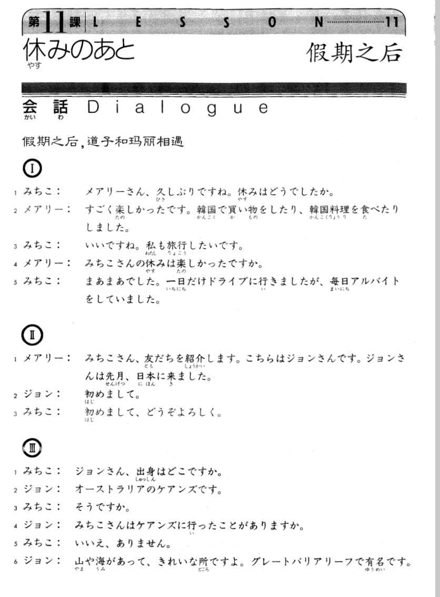

**[[ ../Menu.md | Home ]]**

## 第11课　休むの後・假期之后
**假期之后，道子和玛丽相遇**
**みちこ：玛丽，好久不见了。假期怎么样？**
メアリーさん、久しぶりですね。休みはどうでしたか。

**メアリー：很有意思。我在韩国又购物又吃朝鲜饭菜了。**
すごく楽しかったです。韓国で買い物をしたり、韓国料理を食べたりしました。

**みちこ：那太好啦！我也想去旅行。**
いいですね。私も旅行したいです。

**メアリー：你过了一个愉快的假期吗？**
みちこさんの休みは楽しかったですか。

**みちこ：还行。我只开车出去了一天，其余每天都在打工了。**
まあまあでした。一日だけドライブに行きましたが、毎日アルバイトをしていました。

**メアリー：道子，我想把我的一个朋友介绍给你认识认识。这是约翰，他是上个月来的日本。**
みちこさん、友だちを紹介します。こちらはジョンさんです。ジョンさんは先月、日本に来ました。

**ジョン：你好。**
初めまして。

**みちこ：你好。请多多关照。**
初めまして、どうぞよろしく。

**みちこ：约翰，你从哪儿来？**
ジョンさん、出身はどこですか。

**ジョン：我来自澳大利亚的凯恩茨。**
オーストラリアのケアンズです。

**みちこ：是嘛！**
そうですか。

**ジョン：你去过凯恩茨吗？**
みちこさんはケアンズに行ったことがありますか。

**みちこ：没有，没去过。**
いいえ、ありません。

**ジョン：那里有山和海，是个漂亮的地方，它因珊瑚礁而出名。你从哪儿来？**
山や海があって、きれいな所ですよ。グレートバリアリーフで有名です。みちこさんはどこの出身ですか。

**みちこ：来自长野，以后请到我家玩吧。食物也很好吃的。**
長野です。今度遊びに来てください。食べ物もおいしいですよ。

**ジョン：我一定会去的。**
ぜひ、行きたいです。

---
