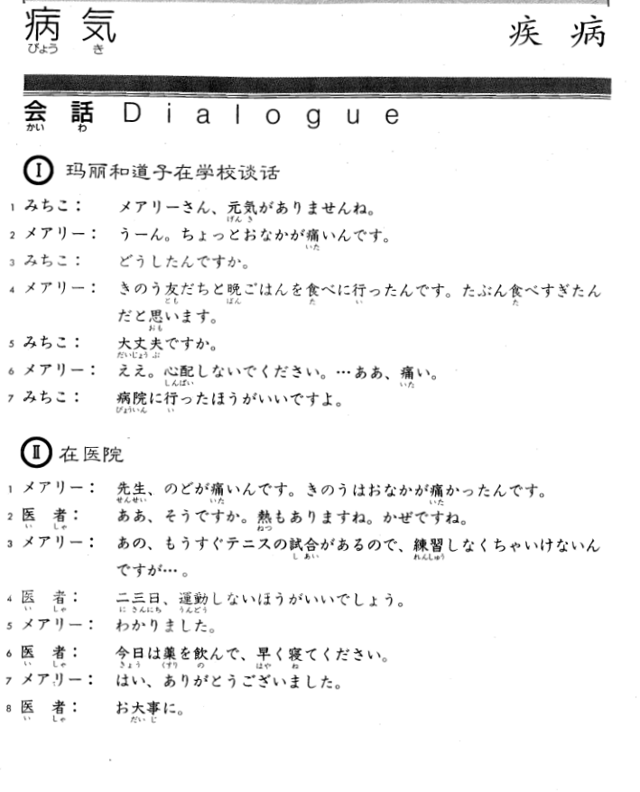
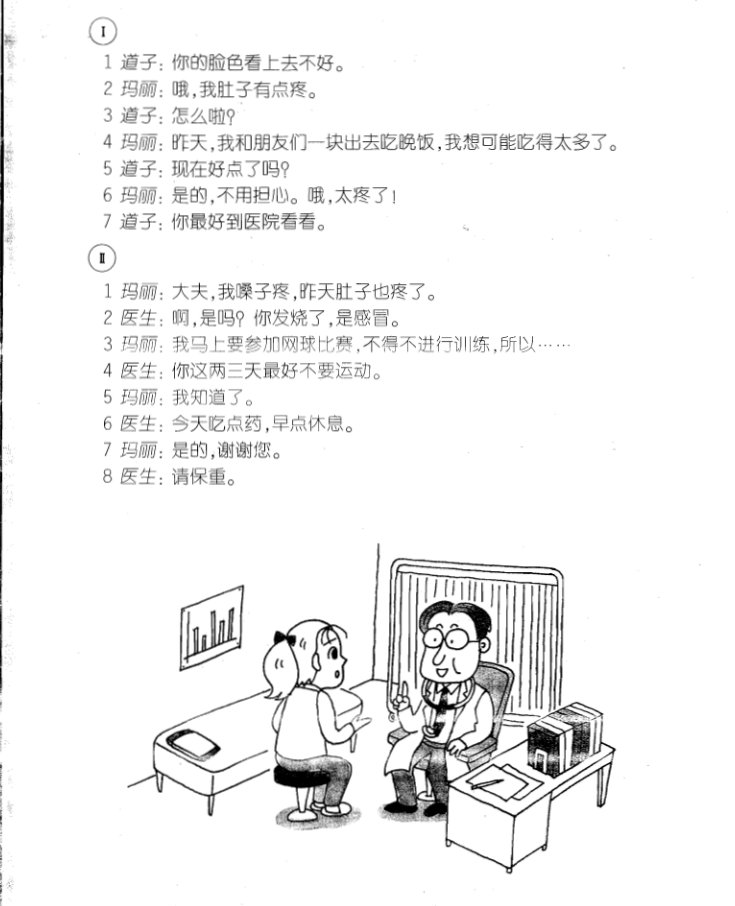

**[Home](../Menu.md)**

## 第12课　病気・疾病
**玛丽和道子在学校谈话**

みちこ：你的脸色看上去不好。

メアリーさん、元気がありませんね。

メアリー：哦，我肚子有点疼。

うーん。ちょっとおなかが痛いんです。

みちこ：怎么啦?

どうしたんですか。

メアリー：昨天，我和朋友们一块出去吃晚饭，我想可能吃得太多了。

きのう友だちと晩ごはんを食べに行ったんです。たぶん食べすぎたんだと思います。

みちこ：现在好点了吗?

大丈夫ですか。

メアリー：是的，不用担心。哦，太疼了！

ええ。心配しないでください。···ああ、痛い。

みちこ：你最好到医院看看。

病院に行ったほうがいいですよ。

**在医院**

メアリー：大夫，我嗓子疼，昨天肚子也疼了。

先生、のどが痛いんです。きのうはおなかが痛かったんです。

医者：啊，是吗？你发烧了，是感冒。

ああ、そうですか。熱もありますね。かぜですね。

メアリー：我马上要参加网球比赛，不得不进行训练，所以……

あの、もうすぐテニスの試合があるので、練習しなくちゃいけないんですが···。

医者：你这两三天最好不要运动。

二三日、運動しないほうがいいでしょう。

メアリー：我知道了。

わかりました。

医者：今天吃点药，早点休息。

今日は薬を飲んで、早く寝てください。

メアリー：是的，谢谢您。

はい、ありがとうございました。

医者：请保重。

お大事に。

---
