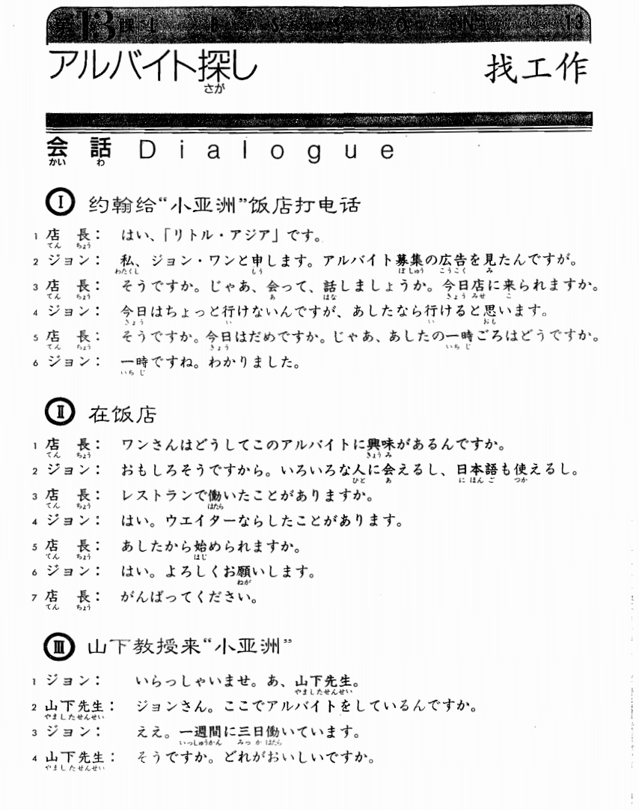
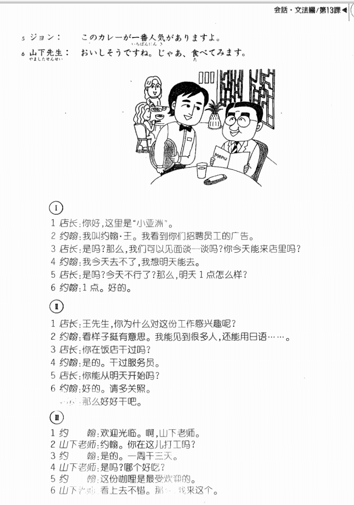

**[[ ../Menu.md | Home ]]**

## 第13课　アルバイト探し・找工作
**约翰给小亚洲饭店打电话**
**店長：你好，这里是“小亚洲”。**
はい、「リトル・アジア」です。

**ジョン：我叫约翰王。我看到你们招聘员工的广告。**
私、ジョン王と申します。アルバイト募集の広告を見たんですが。

**店長：是吗？那么我们可以见面谈一谈吗？你今天能来店里吗？**
そうですか。じゃぁ、会って、話しましょうか。今日店に来られますか。

**ジョン：我今天去不了，我想明天能去。**
今日はちょっと行けないんですが、明日なら行けると思います。

**店長：是吗？今天不行了？那么，明天1点怎么样？**
そうですか。今日はだめですか。じゃあ、明日の1時ごろはどうですか。

**ジョン：1点。好的。**
1時ですね。分りました。

**在饭店**
**店長：王先生，你为什么对这份工作感兴趣呢？**
王さんはどうしてこのアルバイトに興味があるんですか。

**ジョン：看样子挺有意思。我能见到很多人，还能用日语……**
面白そうですから。いろいろな人に会えるし、日本語も使えるし。

**店長：你在饭店干过吗？**
レストランで働いたことがありますか。

**ジョン：是的，干过服务员。**
はい。ウェイターならしたことがあります。

**店長：你能从明天开始吗？**
明日から始められますか。

**ジョン：好的，请多关照。**
はい。よろしくお願いします。

**店長：那么好好干吧。**
頑張ってください。

**山下教授来小亚洲**
**ジョン：欢迎光临啊，山下老师。**
いらっしゃいませ。あ、山下先生。

**山下先生：约翰，你在这里打工吗？**
ジョンさん、ここでアルバイトをしているんですか。

**ジョン：是的，一周干三天。**
ええ。1週間に3日働いています。

**山下先生：是吗？哪个好吃？**
そうですか。どれがおいしいですか。

**ジョン：这份咖喱是最受欢迎的。**
このカレーが1番人気がありますよ。

**山下先生：看上去不错，那么我来这个**
美味しそうですね。じゃあ、食べてみます。

---
