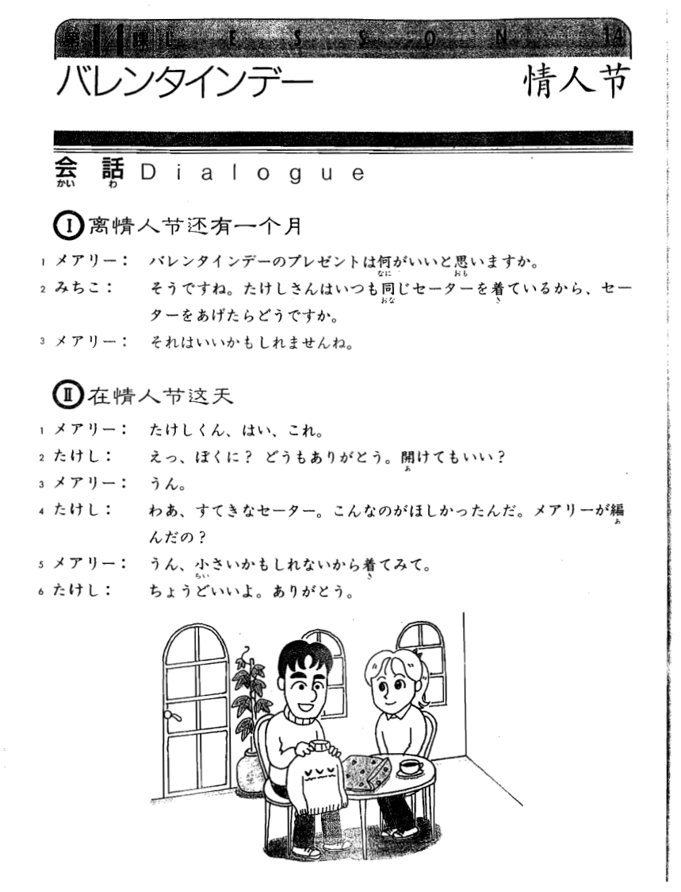
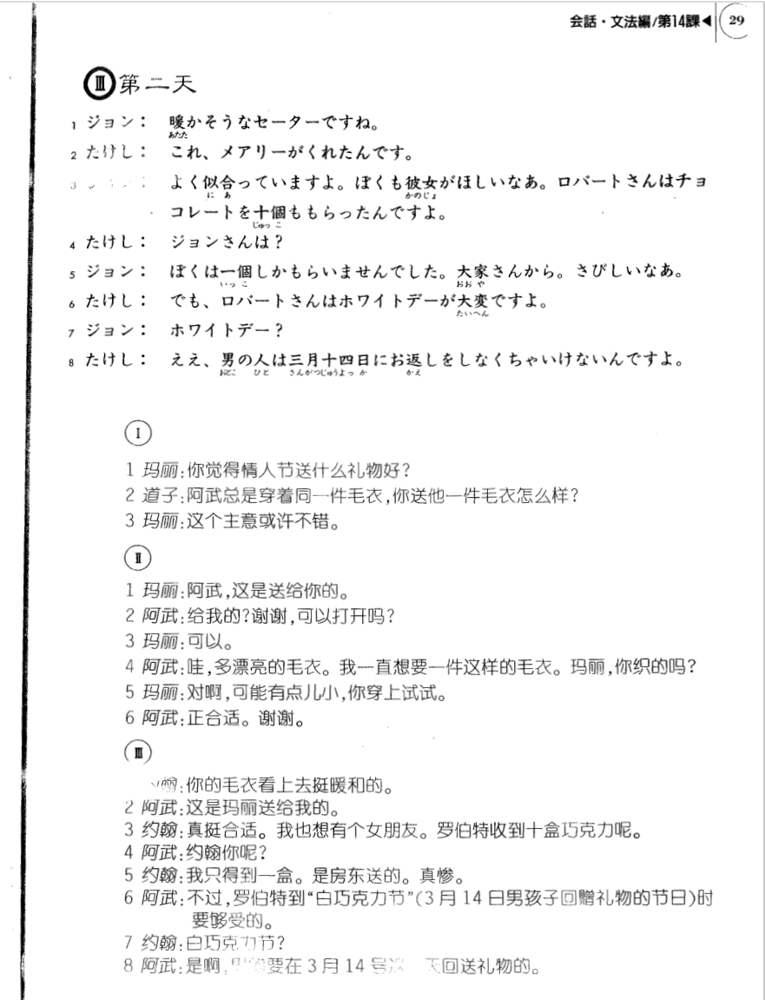

**[Home](../Menu.md)**

## 第14课　バレンタインデー・情人节
**离情人节还有一个月**

メアリー：你觉得情人节送什么礼物好?

バレンタインデーのプレゼントは何かいいと思いますか。

みちご：阿武总是穿着同一件毛衣你送他一件毛衣，你送他一件毛衣怎么样?

そうですね。たけしさんはいつも同じセーターを着ているから、セーターをあげたらどうですか。

メアリー：这个主意或许不错。

それはいいかもしれませんね。

**在情人节这天**

メアリー：阿武，这是送给你的。

たけしくん、はい、これ。

たけし：给我的?谢谢，可以打开吗?

えっ、ぼくに？どうもありがとう。開けてもいい？

メアリー：可以。

うん。

たけし：哇，多漂亮的毛衣。我一直想要一件这样的毛衣。玛丽，你织的吗?

わあ、すてきなセーター。こんなのがほしかったんだ。メアリーが編んだの？

メアリー：对啊，可能有点儿小，你穿上试试。

うん、小さいかもしれないから着てみて。

たけし：正合适。谢谢。

ちょうどいいよ。ありがどう。

**第二天**

ジョン：你的毛衣看上去挺暖和的。

暖かそうなセーターですね。

たけし：这是玛丽送给我的。

これ、メアリーがくれたんです。

ジョン：真挺合适。我也想有个女朋友。罗伯特收到十盒巧克力呢。

よく似合っていますね。ぼくも彼女がほしいなあ。ロバートさんはチョコレートを十個ももらったんですよ。

たけし：约翰你呢?

ジョンさんは？

ジョン：我只得到一盒。是房东送的。真惨。

ぼくは一個しか もらいませんでした。大家さんから。さびしいなあ。

たけし：不过罗伯特到“白巧克力节”(3月14日男孩子回赠礼物的节日)时要够受的。

でも、ロバートさんはホワイトデーが大変ですよ。

ジョン：白巧克力节?

ホワイトデー？

たけし：是啊，男的要在3月14号那一天回送礼物的。

ええ。男の人は三月十四日にお返しをしなくちゃいけないんです。

---
