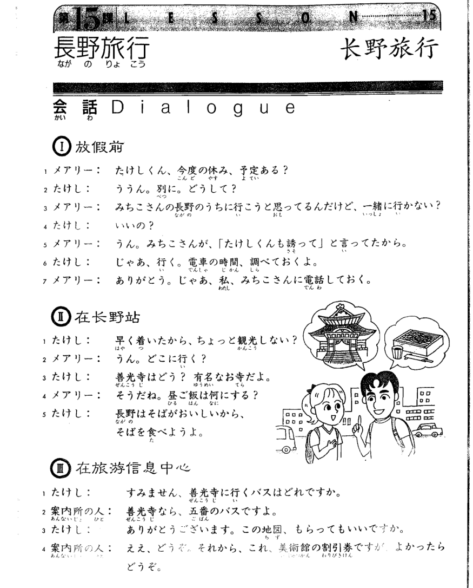
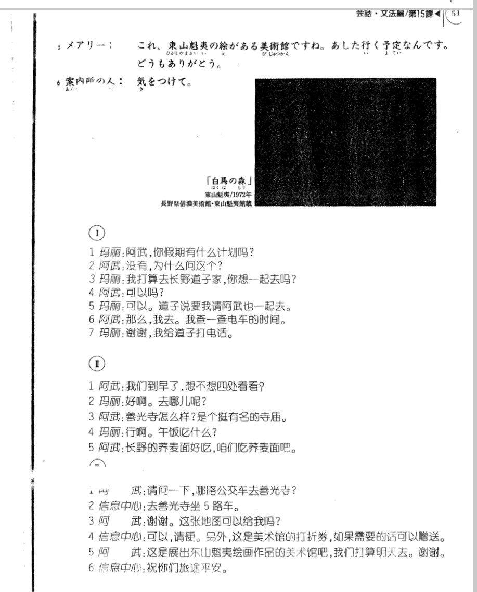

**[[ ../Menu.md | Home ]]**

## 第15课　長野旅行・长野旅行
**放假前**
**メアリー：阿武你假期有什么计划吗?**
たけしくん、今度の休み、予定ある？

**たけし：没有，为什么问这个?**
ううん。別に。どうして？

**メアリー：我打算去长野道子家，你想一起去吗?**
みちこさんの長野のうちに行こうと思ってるんだけど、一緒に行かない？

**たけし：可以吗?**
いいの？

**メアリー：可以。道子说要我请阿武也一起去。**
うん。みちこさんが、「たけしくんも誘って」と言ってたから。

**たけし：那么，我去。我查一查电车的时间。**
じゃあ、行く。電車の時間、調べておくよ。

**メアリー：谢谢，我给道子打电话。**
ありがどう。じゃあ、みちこさんに電話しておく。

**在长野站**
**メアリー：我们到早了，想不想四处看看?**
早く着いたから、ちょっと観光しない？>

**たけし：好啊。去哪儿呢?**
うん。どこに行く？

**メアリー：善光寺怎么样?是个挺有名的寺庙。**
善光寺はどう？有名なお寺だよ。

**たけし：行啊。午饭吃什么?**
そうだね。昼ご飯は何にする？

**メアリー：长野的荞麦面好吃，咱们吃荞麦面吧。**
長野はそばがおいしいから。そばを食べようよ。

**在旅游信息中心**
**たけし：请问一下，哪路公交车去善光寺?**
すみません。善光寺にバスはどれですか。

**案内書の人：去善光寺坐5路车。**
善光寺なら、五番のバスですよ。

**たけし：谢谢。这张地图可以给我吗?**
ありがどうございます。この地図、もらってもいいですか。

**案内書の人：可以，请便。另外，这是美术馆的打折券，如果需要的话可以赠送。**
ええ、どうぞ。それから、これ、美術館の割引券ですが、よかったらどうぞ。

**メアリー：这是展出东山魁夷绘画作品的美术馆吧，我们打算明天去。谢谢。**
これ、東山魁夷の絵がある美術館ですね。あした行く予定なんです。どうもあるがどう。

**案内書の人：祝你们旅途平安。**
気をつけて。

---
