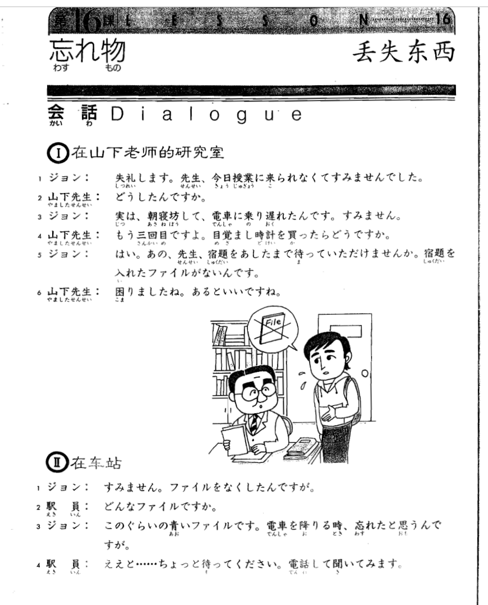
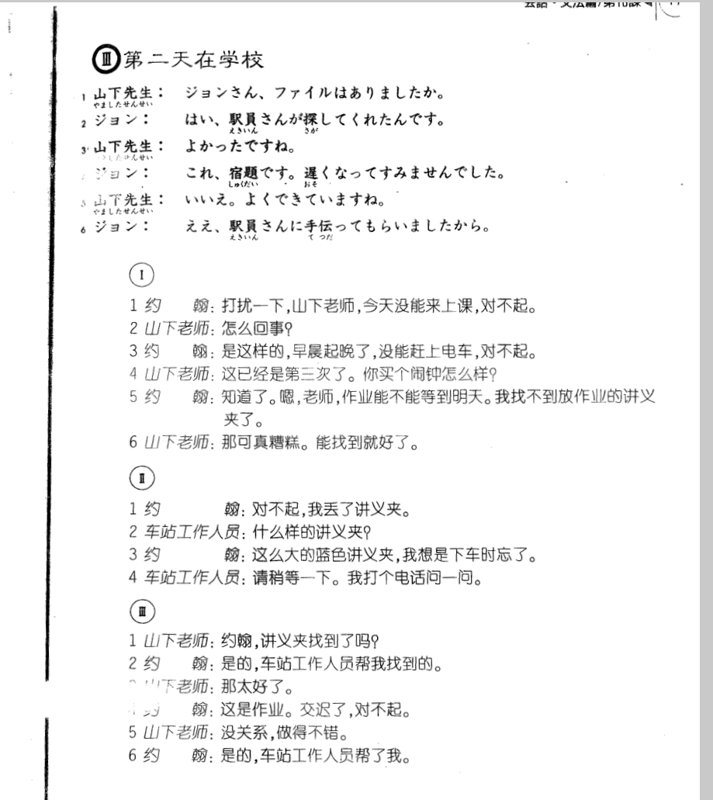

**[[ ../Menu.md | Home ]]**

## 第16课　忘れ物・丢失东西
**在山下老师的研究室**
**ジョン：打扰一下，山下老师，今天没能来上课，对不起。**
失礼します。先生、今日授業に来られなくて すみませんでした。

**山下先生：怎么回事?**
どうしたんですか。

**ジョン：是这样的，早晨起晚了，没能赶上电车，对不起。**
実は、朝寝坊して、電車に乗り遅れたんです。すみません。

**山下先生：这已经是第三次了。你买个闹钟怎么样？**
もう三回目ですよ。目覚まし時計を買ったらどうですか。

**ジョン：知道了。嗯，老师，作业能不能等到明天。我找不到放作业的讲义文件夹了。**
はい。あの、先生、宿題をあしたまで待っていただけませんか。宿題を入れたファイルがないんです。

**山下先生：那可真糟糕。能找到就好了。**
困りましたね。あるといいですね。

**在车站**
**ジョン：对不起，我丢了讲义夹。**
すみません。ファイルをなくしたんですが。

**駅員：什么样的讲义夹？**
どんなファイルですか。

**ジョン：这么大的蓝色讲义夹，我想是下车时忘了。**
このぐらいの青いファイルです。電車を降りる時、忘れたと思うんですが。

**駅員：请稍等一下。我打个电话问一问。**
ええど......ちょっと待ってください。電話して聞いてみます。

**第二天在学校**
**山下先生：约翰讲义夹找到了吗?**
ジョンさん、ファイルはありましたか。

**ジョン：是的，车站工作人员帮我找到的。**
はい、駅員さんが探してくれたんです。

**山下先生：那太好了。**
よかったですね。

**ジョン：这是作业。交迟了，对不起。**
これ、宿題です。遅くなってすみませんでした。

**山下先生：没关系，做得不错。**
いいえ。よくできていますね。

**ジョン：是的，车站工作人员帮了我。**
ええ。駅員さんに手伝ってもらいましたから。

---
