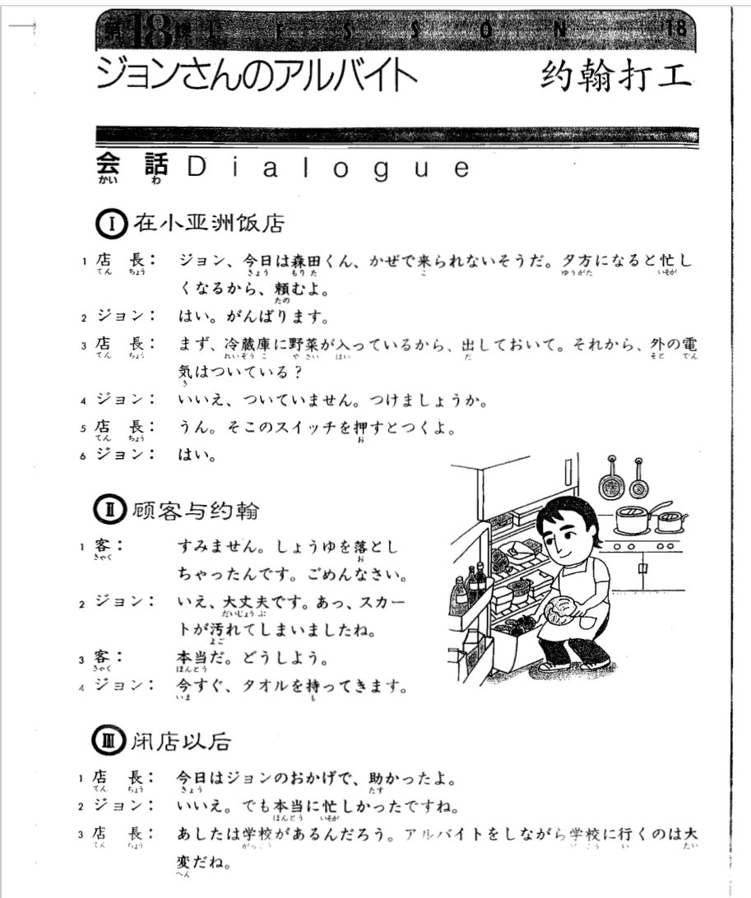
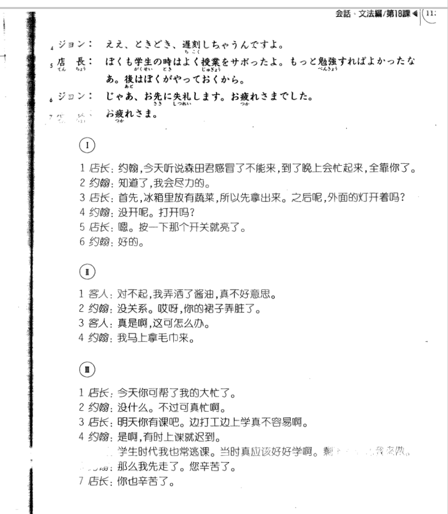

**[[ ../Menu.md | Home ]]**

## 第18课　ジョンさんのアルバイト・约翰打工
**在小亚洲饭店**
**店長：约翰，今天听说森田君感冒了不能来，到了晚上会忙起来，全靠你了。**
ジョンさん、今日は森田くん、かぜで　来られないそうだ。夕方になると　忙しくなるから、頼むよ。

**ジョン：知道了，我会尽力的。**
はい。がんばります。

**店長：首先，冰箱里放有蔬菜，所以先拿出来。之后呢，外面的灯开着吗?**
まず、冷蔵庫に野菜が入っているから、出しておいて。それから、外の電機はついている？

**ジョン：没开呢。打开吗?**
いいえ、ついていません。つけましょうか。

**店長：嗯。按一下那个开关就亮了。**
うん。そこのスイッチを押すと　つくよ。

**ジョン：好的。**
はい。

**顾客与约翰**
**客：对不起，我弄洒了酱油，真不好意思。**
しみません。醤油を　落とし　ちゃったんです。ごめんなさい。

**ジョン：没关系。哎呀，你的裙子弄脏了。**
いえ、大丈夫です。あっ、スカートが汚れて　しまいましたね。

**客：真是啊，这可怎么办。**
本当だ。どうしよう。

**ジョン：我马上拿毛巾来。**
今すぐ。タオルを持ってきます。

**闭店后**
**店長：今天你可帮了我的大忙了。**
今日はジョンさんのおかげで、助かったよ。

**ジョン：没什么。不过可真忙啊。**
いいえ。でも本当に忙しかったですね。

**店長：明天你有课吧。边打工边上学真不容易啊。**
あしたは　学校があるんだろう。アルバイトをしながら　学校に行くのは大変だね。

**ジョン：是啊，有时上课就迟到。**
ええ、ときどき、遅刻し　ちゃうんですよ。

**店長：学生时代我也常逃课。当时真应该好好学啊。剩下的放着我来做。**
ぼくも学生の時は　よく授業をサボったよ。もっと勉強すれば　よかったなあ。後は　ぼくが　やっておくから。

**ジョン：那么我先走了。您辛苦了。**
じゃあ、お先に失礼します。お疲れさまでした。

**店長：你也辛苦了。**
お疲れさま。

---
