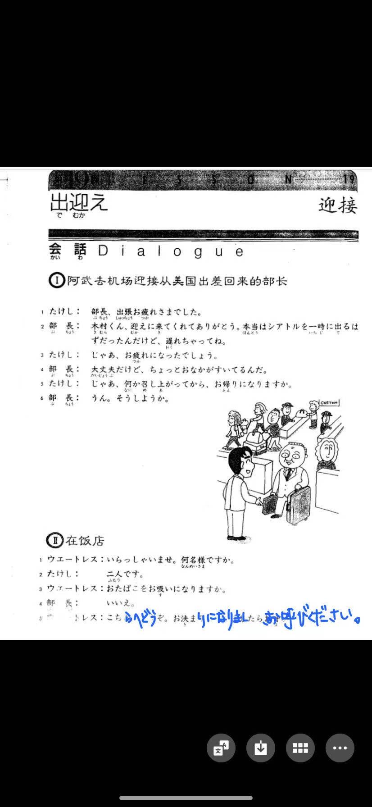
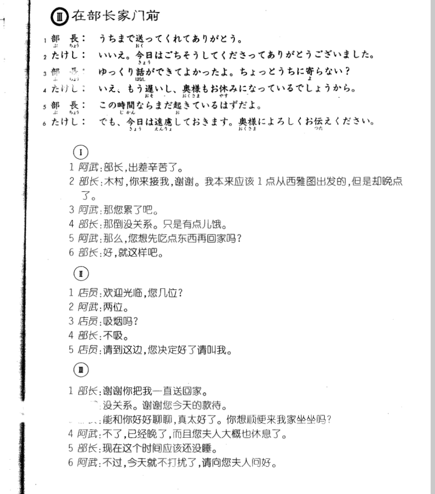

**[[ ../Menu.md | Home ]]**

## 第19课　出迎え・迎接
**阿武去机场迎接从美国出差回来的部长**
**たけし：部长，出差辛苦了。**
部長、出張　お疲れ様でした。

**部長：木村你来接我谢谢。我本来应该1点从西雅图出发的，但是却晚点了。**
木村くん、迎えに　来てくれて　ありがとう。本当は　シアトルを　一時に　出る　はずだったんだ　けど、遅れちゃって　ね。

**たけし：那您累了吧。**
じゃあ、お疲れになった　でしょう。

**部長：那倒没关系。只是有点儿饿。**
大丈夫だ　けど、ちょっと　お腹が　すいてるんだ。

**たけし：那么，您想先吃点东西再回家吗?**
じゃあ、何か　召し上がって　から、お帰り　なりますか。

**部長：好，就这样吧。**
うん。そう　しようか。

**在饭店**
**ウエートレス：欢迎光临，您几位?**
いらっしゃいませ。何名様ですか。

**たけし：两位。**
二人です。

**ウエートレス：吸烟吗?**
おタバコを　お吸いに　なりますか。

**部長：不吸。**
いいえ。

**ウエートレス：请到这边，您决定好了请叫我。**
こちらへ　どうぞ。お決まりに　なりまし　たら、お呼び　ください。

**在部长家门前**
**部長：谢谢你把我一直送回家。**
うちまで　送って　くれて　ありがとう。

**たけし：没关系。谢谢您今天的款待。**
いいえ。今日は　ごちそうして　くださって　ありがとう　ございました。

**部長：能和你好好聊聊，真太好了。你想顺便来我家坐坐吗?**
ゆっくり　話が　できて　よかったよ。ちょっと　うちに　よらない？

**たけし：不了已经晚了而且您夫人大概也休息了。**
いえ。もう遅いし、奥様も　お休みに　なっている　でしょう　から。

**部長：现在这个时间应该还没睡。**
この時間なら　まで起きている　はずだよ。

**たけし：不过，今天就不打扰了，请向您夫人问好。**
でも、今日は　遠慮して　おきます。奥様に　よろしく　お伝え　ください。

---
