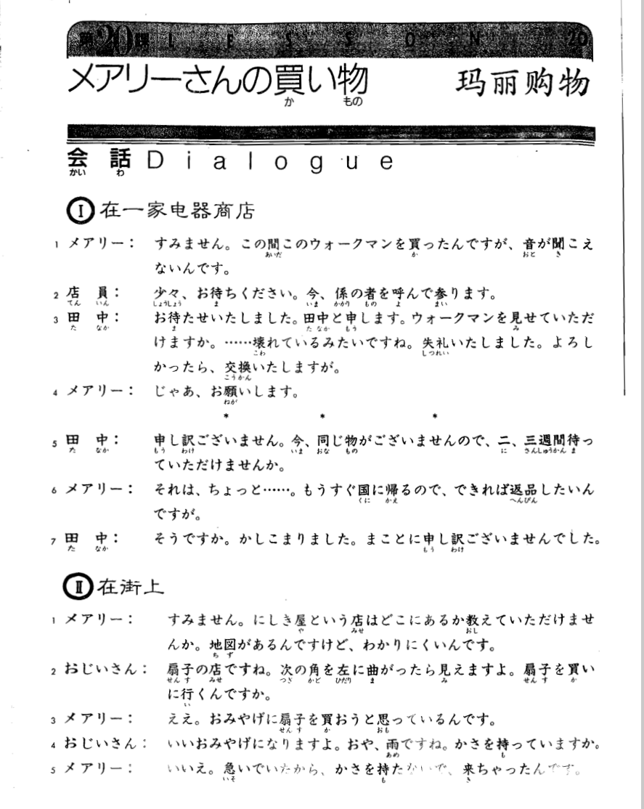
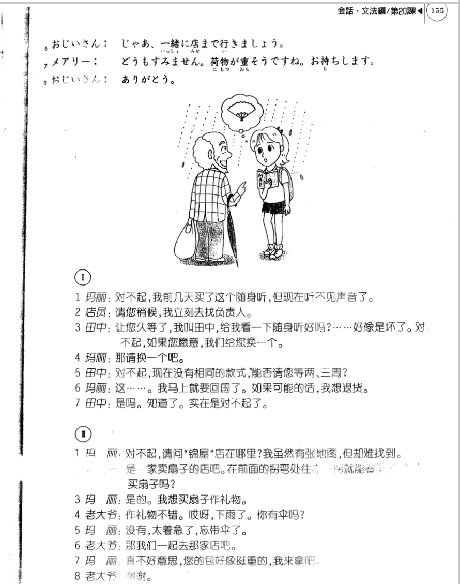

**[[ ../Menu.md | Home ]]**

## 第20课　メアリーさんの買い物・玛丽购物
**在一家电器商店**
**メアリー：对不起，我前几天买了这个随身听，但现在听不见声音了。**
すみません。この間　このウォークマンを　買ったんですが、音が　聞こえないんです。

**店員：请您稍候我立刻去找负责人。**
少々、お待ちください。今、係の者を　呼んで参ります。

**田中：让您久等了，我叫田中，给我看一下随身听好吗?......好像是坏了。对不起，如果您愿意，我们给您换一个。**
お待たせ　いたしました。田中と　申します。ウォークマンを　見せて　いただけますか。……壊れている　みたいですね。失礼　いたしました。よろしたっ　たら、交換　いたしますが。

**メアリー：那请换一个吧。**
じゃあ、お願いします。

**田中：对不起，现在没有相同的款式，能否请您等两、三周?**
申し訳　ございません。今、同じ物が　ございませんので、ニ、三週間　待って　いただけせんか。

**メアリー：这......。我马上就要回国了。如果可能的话，我想退货。**
それは、ちょっと……。もう　直ぐ　国に　帰るので、できれば　返品したいん　ですが。

**田中：是吗。知道了。实在是对不起了。**
そうですか。かしこ　まり　ました。まことに　申し訳　ございません　でした。

**在街上**
**メアリー：对不起，请问“锦屋”店在哪里?我虽然有张地图，但却难找到。**
すみません。にしき屋と　ういう店は　どこに　あるか　教えて　いただけ　ませんか。地図が　あるんです　けど、わかり　にくいんです。

**おじいさん：是一家卖扇子的店吧。在前面的拐弯处往左一拐就能看到了，你要去买扇子吗?**
扇子の　店ですね。次の角を　左に　曲がったら　見えますよ。扇子を　買いに　行くん　ですか。

**メアリー：是的。我想买扇子作礼物。**
ええ。おみやげに　扇子を　買おう　と思っているんです。

**おじいさん：作礼物不错。哎呀，下雨了。你有伞吗?**
いい　おみやげに　なりますよ。おや、雨ですね。かさを　持っていますか。

**メアリー：没有，太着急了，忘带伞了。**
いいえ。急いで　いたから、かさを　持た　ないで、きちゃったんです。

**おじいさん：那我们一起去那家店吧。**
じゃあ、一緒に　店まで　行きましょう。

**メアリー：真不好意思，您的包好像挺重的，我来拿吧。**
どうも　すみません。荷物が　重そう　ですね。お持ちします。

**おじいさん：谢谢。**
ありがとう。

---
