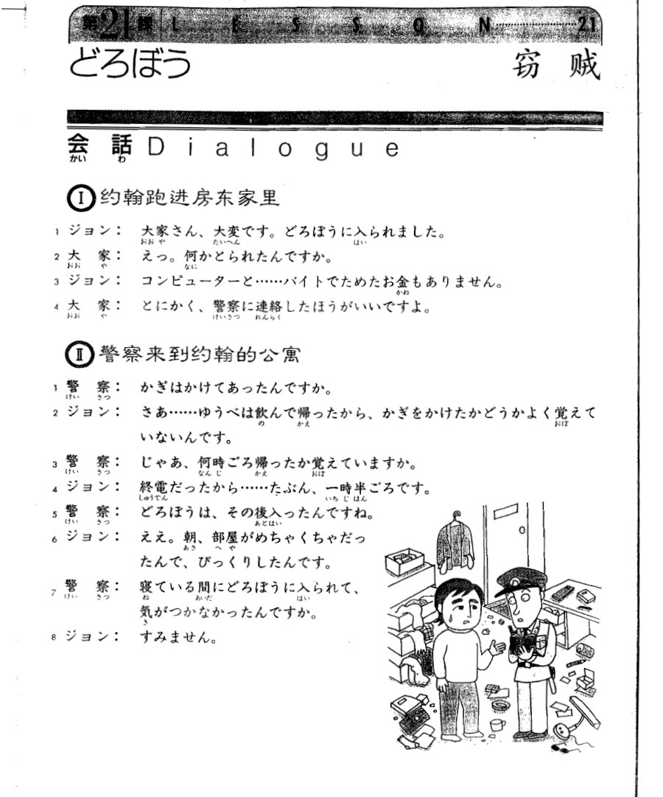
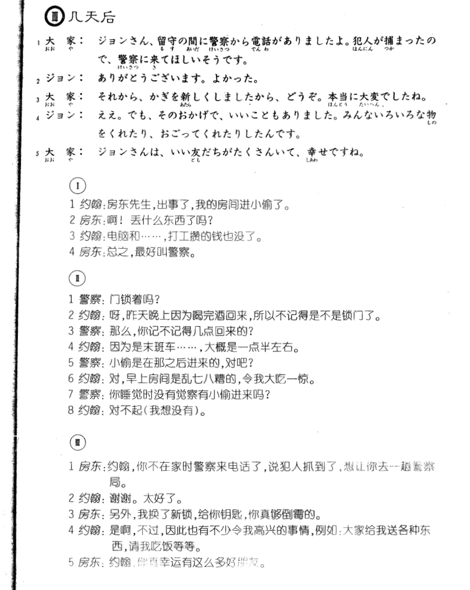

**[[ ../Menu.md | Home ]]**

## 第21课　どろぼう・窃贼
**约翰跑进房东家里**
**ジョン：房东先生，出事了，我的房间进小偷了。**
大家さん、大変です。どろぼうに　入られました。

**大家：啊！丢什么东西了吗？**
えっ。何か　とられたん　ですか。

**ジョン：电脑和·····打工攒的钱也没了。**
コンピューターと……バイトで　ためたお金　もありません。

**大家：总之，最好叫警察。**
とにかく、警察に　連絡した　ほうがいいですよ。

**警察来到约翰的公寓**
**警察：门锁着吗？**
かぎは　かけてあったん　ですか。

**ジョン：呀，昨天晚上因为喝完酒回来，所以不记得是不是锁门了。**
さあ……ゆうべは飲んで帰ったから、かぎをかけた　かどうか　よく覚えていないんです。

**警察：那么，你记不记得几点回来的？**
じゃあ、何時ごろ帰ったか　覚えていますか。

**ジョン：因为是末班车····,大概是一点半左右。**
終電だったから……たぶん、一時半ごろです。

**警察：小偷是在那之后进来的，对吧？**
どろぼうは、その後　入ったんですね。

**ジョン：对，早上房间是乱七八糟的，令我大吃一惊。**
ええ。朝、部屋が　めちゃく　ちゃだったんで、びっくり　したんです。

**警察：你睡觉时没有觉察有小偷进来吗？**
寝ている間に　どろぼうに　入られて、気が　つかなかったんですか。

**ジョン：对不起（我想没有）。**
すみません。

**几天后**
**大家：约翰，你不在家时警察来电话了，说犯人抓到了，想让你去一趟警察局。**
ジョンさん、留守の間に　警察から電話が　ありましたよ。犯人が捕まったので、警察に　来てほしい　そうです。

**ジョン：谢谢。太好了。**
ありがとう　ございます。よかった。

**大家：另外，我换了新锁，给你钥匙，你真够倒霉的。**
それから、かざを　新しくしました　から、どうぞ。本当に大変でしたね。

**ジョン：是啊，不过，因此也有不少令我高兴的事情，例如：大家给我送各种东西，请我吃饭等等。**
ええ。でも、そのおかげで、いいことも　ありました。みんな　いろいろな物をくれたり、おごってくれたり　したんです。

**大家：约翰，仰真幸运有这么多好朋友。**
ジョンさんは、いい友だちが　たくさんいて、幸せですね。

---
