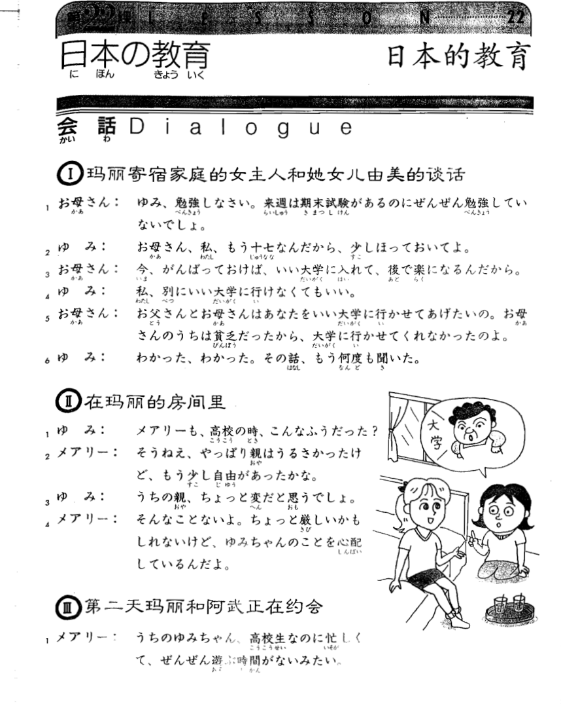
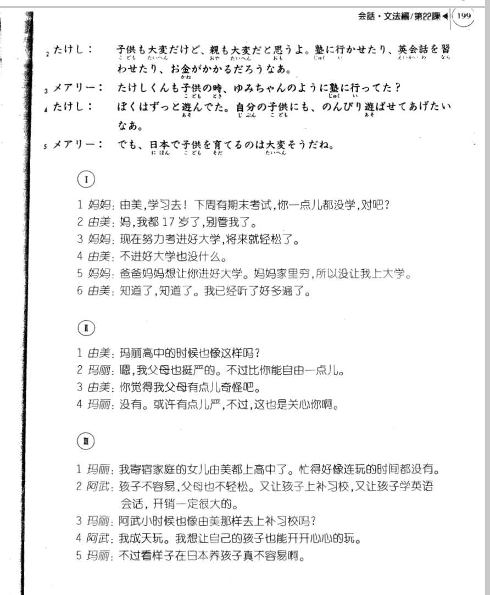

**[[ ../Menu.md | Home ]]**

## 第22课　日本の教育・日本的教育
**玛丽寄宿家庭的女主人和他女儿的谈话**
**お母さん：由美，学习去！下周有期末考试，你一点儿都没学，对吧？**
ゆみ、勉強しなさい。来週は　期末試験があるのに　ぜんぜん勉強していないでしょ。

**ゆみ：妈，我都17岁了，别管我了。**
お母さん、私、もう十七なんだ　から、少し　ほっておいてよ。

**お母さん：现在努力考进好大学，将来就轻松了。**
今、がんばって　おけば、いい大学に入れて、後で　楽になるんだ　から。

**ゆみ：不进好大学也没什么。**
私、別にいい大学に　行けなくてもいい。

**お母さん：爸爸妈妈想让你进好大学。妈妈家里穷，所以没让我上大学。**
お父さんと　お母さんは　あなたを　いい大学に　行かせてあげたいの。お母さんのうちは　貧乏だった　から、大学に行かせて　くれなかったのよ。

**ゆみ：知道了，知道了。我已经听了好多遍了。**
わかった、わかった。その話、もう　何度も聞いた。

**在玛丽的房间里**
**ゆみ：玛丽高中的时候也像这样吗？**
メアリーも、高校の時、こんな　そうだった?

**メアリー：嗯，我父母也挺严的。不过比你能自由一点儿。**
そうねえ、やっばり　親は　うるさかった　けど、もう少し自由が　あったかな。

**ゆみ：你觉得我父母有点儿奇怪吧。**
うちの親、ちょっと変だ　と思う　でしょ。

**メアリー：没有。或许有点儿严，不过，这也是关心你啊。**
そんなこと　ないよ。ちょっと　厳しい　かもしれない　けど、ゆみちゃんのことを　心配しているんだよ。

**第二天玛丽和阿武正在约会**
**メアリー：我寄宿家庭的女儿由美都上高中了。忙得好像连玩的时间都没有。**
うちのゆみちゃん、　高校生なのに　忙しくて、ぜんぜん　遊ぶ時間がない　みたい。

**たけし：孩子不容易，父母也不轻松。又让孩子上补习校，又让孩子学英语会话，开销一定很大的。**
子供も大変だ　けど、親も大変だ　と思うよ。塾に　行かせたり、英会話を　習わせたり、お金が　かかる　だろうなあ。

**メアリー：阿武小时候也像由美那样去上补习校吗？**
たけしくんも子供の時、ゆみちゃんのように　塾に行ってた?

**たけし：我成天玩。我想让自己的孩子也能开开心心的玩。**
ほくは　ずっと　遊んでた。自分の子供にも、のんびり　遊ばせて　あげ　たいなあ。

**メアリー：不过看样子在日本养孩子真不容易啊。**
でも、日本で　子供を育てるのは　大変そうだ　ね。

---
