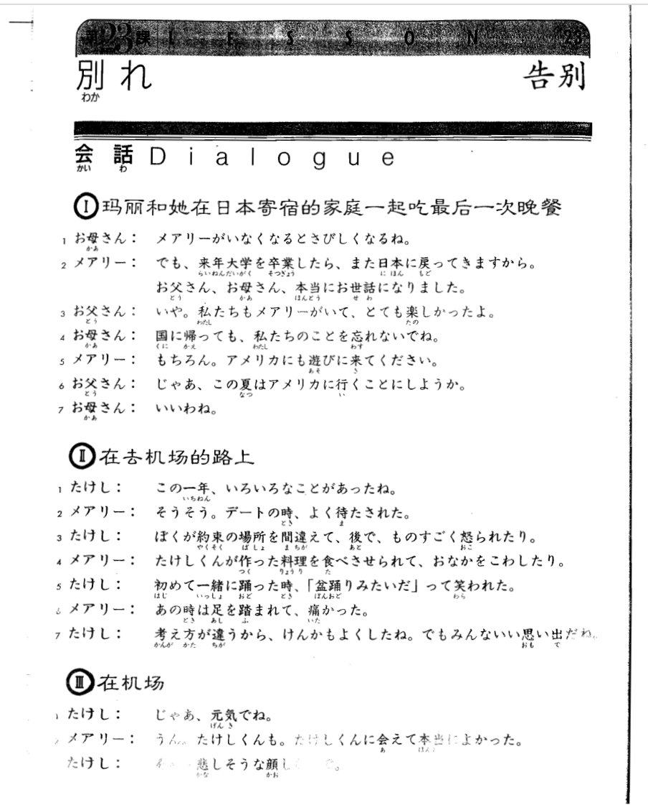
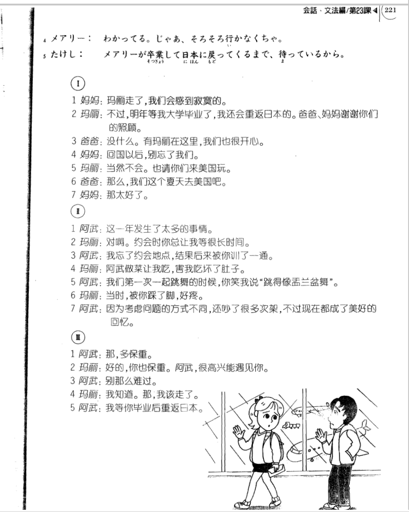

**[[ ../Menu.md | Home ]]**

## 第23课　別れ・告别
**玛丽和她在日本寄宿的家庭一起吃最后一次晚餐**
**お母さん：玛丽走了，我们会感到寂寞的。**
メアリーが　いなくなると　さびしくなるね。

**メアリー：不过，明年等我大学毕业了，我还会重返日本的。爸爸、妈妈谢谢你们的照顾。**
でも、来年　大学を　卒業したら、また　日本に　戻ってきますから。お父さん、お母さん、本当に　お世話に　なりました。

**お父さん：没什么。有玛丽在这里，我们也很开心。**
いや。私たちも　メアリーがいて、とても　楽しかったよ。

**お母さん：回国以后，别忘了我们。**
国に　帰っても、私たちのことを　忘れないでね。

**メアリー：当然不会。也请你们来美国玩。**
もちろん。アメリカにも　遊びに　来てください。

**お父さん：那么，我们这个夏天去美国吧。**
じゃあ、この夏は　アメリカに　行くことに　しようか。

**お母さん：那太好了。**
いいわね。

**在去机场的路上**
**たけし：这一年发生了太多的事情。**
この一年、いろいろな　ことが　あったね。

**メアリー：对啊。约会时你总让我等很长时间。**
そうそう。デートの時、よく　待たされた。

**たけし：我忘了约会地点，结果后来被你训了一通。**
ぼくが　約束の場所を　間違えて、後で、ものすごく　怒られたり。

**メアリー：阿武做菜让我吃，害我吃坏了肚子。**
たけしくんが　作った料理を　食べさせられて、おなかを　こわしたり。

**たけし：我们第一次一起跳舞的时候，你笑我说“跳得像盂兰盆舞”。**
初めて一緒に　踊った時、「盆踊りみたいだ」って　笑われた。

**メアリー：当时，被你踩了脚，好疼。**
あの時は　足を　踏まれて、痛かった。

**たけし：因为考虑问题的方式不同，还吵了很多次架，不过现在都成了美好的回忆。**
考え方が　違うから、けんかも　よくしたね。でも　みんな　いい思いまだね。

**在机场**
**たけし：那，多保重。**
じゃあ、元気でね。

**メアリー：好的，你也保重。阿武，很高兴能遇见你。**
うん。たけしくんも。たけしくんに　会えて　本当によかった。

**たけし：别那么难过。**
そんな　悲しそうな　顔しないで。

**メアリー：我知道。那，我该走了。**
わかってる。じゃあ、そろそろ　行かなくちゃ。

**たけし：我等你毕业后重返日本。**
メアリーが　卒業して　日本に戻ってくる　まで、待っているから。

---
