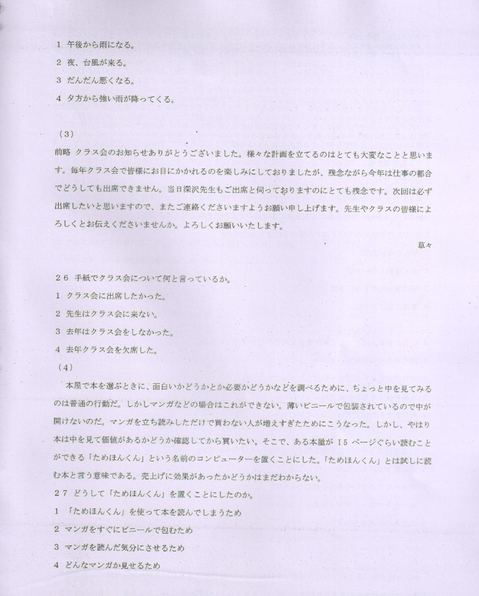

**[Home](../Menu.md)**

紙の手帳

パソコンや　携帯電話などが　広く　使われるように　なって　から、自分の予定を　管理する　ため、それらを　手帳の代わりに　使う人が　多く　なっている。それでも　紙の手帳を　買いたい　という人も　多いの　ではない　だろうか。私も　そう　である。
`___19___`書店の　手帳売り場では、夏の終わり　ごろから　来年用の手帳を　売り　はじめた。`___20___`、手帳というと、黒い表紙の　シンプルな　ものが　多かったが、お店の人に　聞いて　みると、最近は、特に　若い女性　向けの　商品が`___21___`。女性向けの　手帳は　以前から　売っているが、今年は　種類が　たくさんある　ようだ。`___22a___`、ピンクなど　明るく　きれいな　色の　ものや、かわいい　デザインの　もの　も、自分の　好きな　ベンを　取り付けられる　タイプ、手帳を　止める　バンドや　リボンが　付いた　もの　`___22b___`、若い女性が　好みそうな　ものが　そろっている。
私も　仕事で　手帳を　よく　使う　ので、このように　選ぶ　楽しみが　増えた　ことは　うれしい。だが、売り場で　選ぼう　としてみても、商品が　いろいろ　たくさん　あって、`___23___`　どのような　手帳が　ほしいか　考えて　から、売り場へ　向かおうと思う。

19　3
1　あんな　
2　あのような　
3　あった
4　ある

20　2
1　今からは
2　今までは
3　次からは
4　次までは

21　3
1　増えていそうだ　
2　増えているそうだ
3　増えてありそうだ　
4　増えてあるそうだ

22　3
1　aなぜなら/bだから　
2　aところが/bがないので
3　aたとえば/bなど　
4　aたぶん/bであれば

23　3
1　急に決めた
2　急に決まるだろう
3　すぐに決められなかった
4　すぐに決められなかっただろう

---

(1)
ワンさんは　アバートを　さがして　います。なるべく　通勤時間が　短い　場所に　アパートを　借りたい　です。家賃は　1ヶ月　5万円　以内　なら　全額会社　持ちです。ワンさんは　自分では　1円も　負担し　たくない　です。会社から　東駅まで　電車で　30分、西駅まで　35分　かかります。駅から　遠くても　かまわないです　が、バスは　渋滞して　時間通りに　来ない　ことがあります　し、夜　遅く時間は　走っていません　から、使いたく　ありません。
アバート1:東駅から　歩いて　1分。6万円。
アバート2:東駅から　歩いて　20分。4万円。
アパート3:西駅から　歩いて　7分。5万円。
アパート4:西駅から　バスで　3分　歩いて　1分。4万5千円。

24　ワンさんは　どの　アパートに　するか。　3
1　アパート1
2　アバート2
3　アパート3
4　アパート4

---

(2)
午前9時の　天気予報を　お知らせ　致します。現在、東京地方の気温は　20度、雲　ひとつない　いい天気です。
しかし　フィリピン　沖で　発生した　台風15号が　次第に　南から　近づい　てきます。そのため　昼すぎから　風が出て　曇ってくる　でしょう。夕方には　風は　更に強く　なり、ところに　よリ　雨も　降る　でしょう。夜には　風と　雨が　かなり　強くなると　予想されますので　お出かけの際は　ご注意ください。

25　天気はこれからどうなるか。　3
1　午後から雨になる。
2　夜、台風が来る。
3　だんだん悪くなる。
4　夕方から強い雨が降ってくる。

---

(3)
前略　クラス会のお知らせ　ありがとう　ございました。様々な計画を　立てる　のは　とても　大変なこと　と思います。每年　クラス会で　皆様に　お目に　かかれるのを　楽しみに　しておりましたが、残念ながら　今年は　仕事の都合で　どうしても　出席　できません。当日　深沢先生も　ご出席と　伺っておりますのに　とても　残念です。次回は　必ず　出席したい　と思います　ので、また　ご連絡する　くださいますよう　お願い申し上げます。先生や　クラスの　皆様に　よるしくと　お伝え　くださいませんか。よるしく　お願い　いたします。
　　　　　　　　　　　　　　　　　　　　　　　　　　　　　　　　　　　　　　　　　　　　　　　　　　　　　　　　草々

26　手紙で　クラス会に　ついて　何と　言っているか。　1
1　クラス会に出席したかった
2　先生はクラス会に来ない
3　去年はクラス会をしなかった。
4　去年クラス会を欠席した。

---

(4)
本屋で　本を　選ぶ　ときに、面白い　かどうかと　か　必要　かどうか　などを　調べる　ために、ちょっと中を　見てみるのは　普通の　行動だ。しかし　マンガ　などの　場合は　これが　できない。薄い　ビニールで　包装されているので　中が　開けない　のだ。マンガを　立ち読みした　だけで　買わない人が　増えすぎた　ために　こうなった。しかし、やはり　本は　中を　見て　価值がある　かどうか　確認して　から　買いたい。そこで、ある本屋が　15　ページ　くらい　読むことが　できる「ためほんくん」という　名前の　コンピコーターを　置くこと　にした。「ためほんくん」とは　試しに　読む本と　言う意味である。売上げに　効果が　あった　かどうかは　まだ　わからない。

27　どうして「ためほんくん」を置くことにしたのか。　1
1　「ためはんくん」を使って本を読んでしまうため
2　マンガをすくにビニールで包むため
3　マンガを読んだ気分にさせるため
4　どんなマンガか見せるため

---

日本人は　長い間たたみ(※1)の上で　立ったり　座ったり　する　生活を　続けてきた。トイレも　しゃがんて　(※2)していた。その　おかけで　自然に　足や　腰が　丈夫になった。しかし　最近　たたみの部屋がない　家が　增加し　てきた。テープルと　椅子、ベッドを　使い、トイレも　洋式になった。床に　座らない　生活だ。その　おかけで　日本人の足が　長くまっすぐに　なり、昔に　比べて　スタイルが　よくなってきたと　言われている。
しかし　このような　生活の仕方が　「しやがめない子ども」や　「すくに転んでしまう老人」を　生んだ原因の　ーつだと　わかってきた。では、昔のような　家に　戻したら　いいの　か。体のために　たたみの部屋を　用意するのは　難しい　ことだ。足や　腰を　強くする　ために　わさわさ　運動する　のも　大変だ。だから`①`　ただ生活するだけ　で少しでも　足や　腰を　強くできれば　一番いい。やはり　たたみはなくても　床に座る生活を　採り入れるのが　いいの　ではない　だろうか。

(※1)たたみ:和室の床に使う板ではない「い草」と呼ばれる草で作った敷物
(※2)しやがむ:ひさを曲げて尻を床に着けないでそのまま腰を低くする姿勢

28　`①`ただ生活する　だけとは　この場合　どのような生活か。　2
1　何もしない生活
2　全く運動しない生活
3　床に座ったりしない生活
4　普通に過ごす生活

29　昔の日本人は　どうして　足や腰が丈夫だったと言っているか。　2
1　洋式のトイレがなかったから
2　每日何度も足を曲げたり伸ばしたりしていたから
3　足腰を強くするために運動していたから
4　每日たたみの上でずっと座っていたから

30　著者は　どうやって　足や腰を強くしたらいいと言っているか。　3
1　床に座る生活をしたらいい
2　なるべく立っている生活を続けたらいい
3　立ったりすわったりする運動をしたらいい
4　たたみの部屋を作ったらいい

