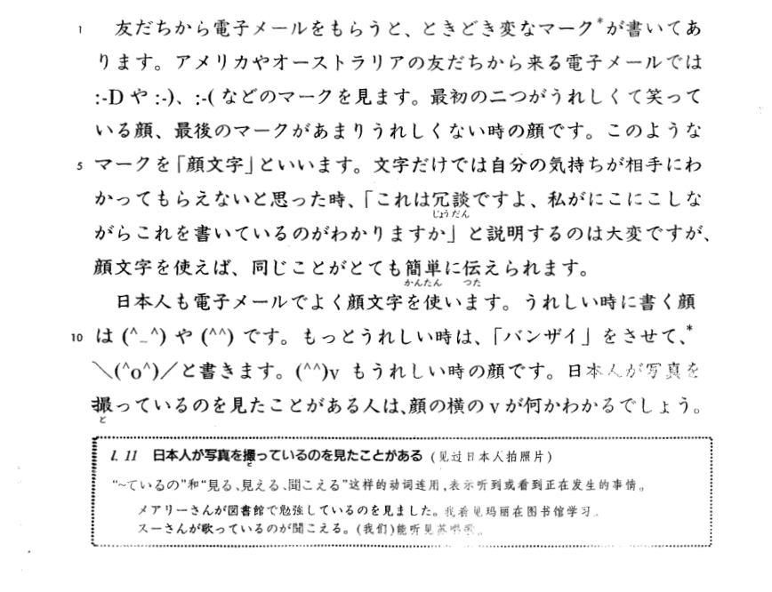

**[[ ../Menu.md | Home ]]**

顔文字1

友だちから　電子メールを　もらうと、ときどき　変なマークが　書いて　あります。アメリカや　オーストラリアの　友だちから来る　電子メールでは　`:ーD`　や　`:ー)`、`ー(`　などのマ一クを　見ます。最初の二つが　うれしくて　笑っている顔、最後のマークが　あまり　うれしくない時の　顔です。このような　マークを「顔文字」と　いいます。文字だけでは　自分の気持ちが　相手に　わかって　もらえないと　思った時、「これは冗談ですよ、私がにこにこ　しながら　これを　書いているのが　わかりますか」と説明するのは　大変ですが、顔文字を使えば、同じことが　とても　簡単に　伝えられます。
日本人も　電子メールで　よく　顔文字を　使います。うれしい時に　書く顔は`(^_^)`　や　`(^^)`　です。もっと　うれしい時は、「バンザイ」を　させて、
`\(^0^)/`　と書きます。`(^^)ｖ`　もうれしい時の　顔です。日本人が　写真を撮っているのを　見たことが　ある人は　顔の横のｖが何か　わかる　でしょう。

日本人が　写真を　撮っているの　を見たことがある(见过日本人拍照片)
“~ているの”和“見る、見える、聞こえる”这样的动词连用，表示听到或看到正在发生的事情。
メアリーさんが　図書館で　勉強しているの　を見ました。我看见玛丽在图书馆学习。
スーさんが歌っているの　が聞こえる。(我们)能听见苏唱歌。

---

顔文字2

英語の顔文字と　日本語の顔文字を　比べると、おもしろいことに　気が　つきます。まず、英語の顔文字は　縦書きですが、日本語の顔文字は　横書きです。また、英語では　口が笑っていますが　日本語では　目が笑っています。
このように、言葉や　文化によって　顔文字は　違いますが、人間の表情は　どう　でしょうか。みなさんは、ほかの国から来た　人の表情を　見た時、その人が　どんな　気持ちか　わかりますか。
最近の研究によると、うれしい時の顔と、ひっくりした時の顔は、言葉や　文化が　違っても、ほとんど　同じようです。ところが、悲しい時や　怒っている時の　表情は、国や　社会によって　ずいぶん　違うことが　わかりました。
ある調査の結果　を見てみましょう。この調查では、日本人の大学生と　アメリカから　日本に　来ている　留学生に　写真を見せて、それが　どんな感情を　表している写真か　答えて　もらいました。
(1)	(2)	

(1)の写真を見た時は、日本人も　アメリカ人も、ほとんど　全員が、これは「うれしい」表情だ　と答えました。(この人が　犬を飼っていたら、その犬も　そう考えるでしょう。)ところが、(2)の写真を見た時は、国によつて　答えが少し　違いました。日本人は　この写真を見て、ほとんど全員か「怒っている」と　答えましたが、アメリカ人は　66%しか　そう考えませんでした。ほかの調査では、ある写真を見て、アメリカ人の　十人に九人が　「こわい」という　気持ちを　表している　表情だ　と考えましたが、日本人は　十人に六人が　「悲しい」表情だ　と答えました。また、アメリカ人が　「怒っている」と　思う表情を、日本人は「軽蔑」の表情だ　と考える　そうです。
みなさんは、日本語を勉強している時や　日本人と話している時、「日本人は　ずいぶん　私と　違う」　と思ったり、「ああ、やっばり日本人も、私と　同じ人間なんだ」　と思ったり　しませんか。表情や　身ぶり　についても、同じような　こどが　言える　かもしれません。
