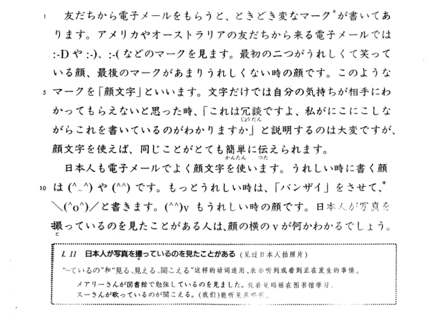

**[Home](../Menu.md)**

顔文字1

友だちから　電子メールを　もらうと、ときどき　変なマークが　書いて　あります。アメリカや　オーストラリアの　友だちから来る　電子メールでは　`:ーD`　や　`:ー)`、`ー(`　などのマ一クを　見ます。最初の二つが　うれしくて　笑っている顔、最後のマークが　あまり　うれしくない時の　顔です。このような　マークを「顔文字」と　いいます。文字だけでは　自分の気持ちが　相手に　わかって　もらえないと　思った時、「これは冗談ですよ、私がにこにこ　しながら　これを　書いているのが　わかりますか」と説明するのは　大変ですが、顔文字を使えば、同じことが　とても　簡単に　伝えられます。
日本人も　電子メールで　よく　顔文字を　使います。うれしい時に　書く顔は`(^_^)`　や　`(^^)`　です。もっと　うれしい時は、「バンザイ」を　させて、
`\(^0^)/`　と書きます。`(^^)ｖ`　もうれしい時の　顔です。日本人が　写真を撮っているのを　見たことが　ある人は　顔の横のｖが何か　わかる　でしょう。

日本人が　写真を　撮っているの　を見たことがある(见过日本人拍照片)
“~ているの”和“見る、見える、聞こえる”这样的动词连用，表示听到或看到正在发生的事情。
メアリーさんが　図書館で　勉強しているの　を見ました。我看见玛丽在图书馆学习。
スーさんが歌っているの　が聞こえる。(我们)能听见苏唱歌。

