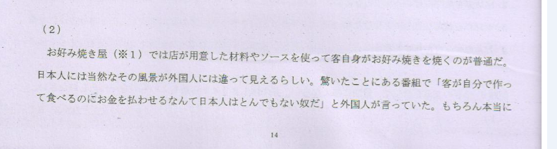
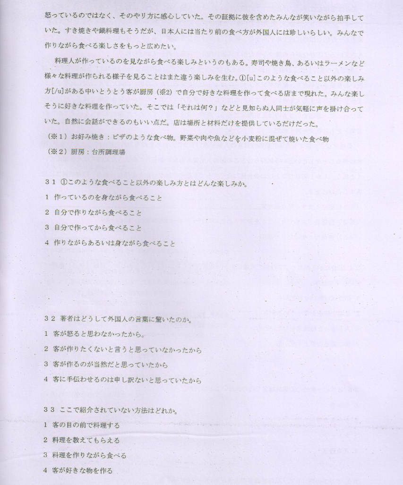
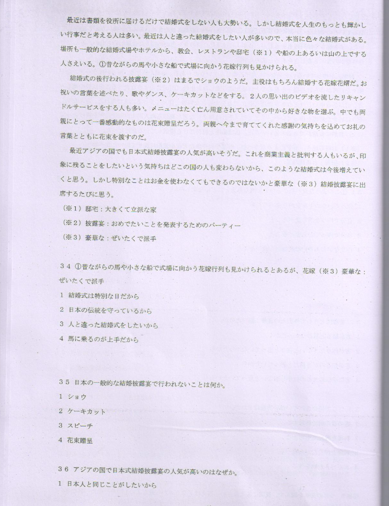
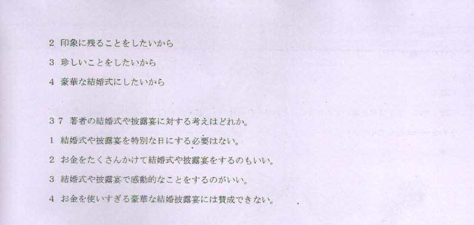
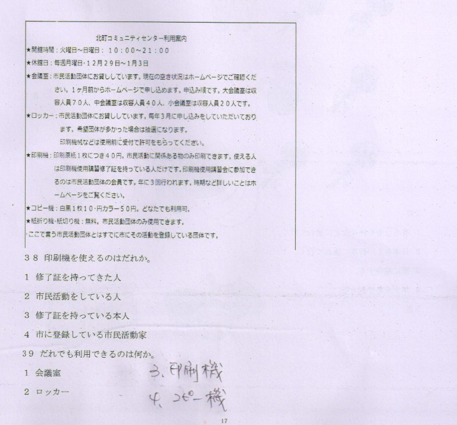

**[[ ../Menu.md | Home ]]**

**阅读**

（2）
お好み　焼き屋（※1）では　店が　用意した　材料や　ソースを　使って　客　自身が　お好み　焼きを　焼くのが　普通だ。日本人には　当然な　その風景が　外国人には　違って　見える　らしい。驚いた　ことにある　番組で　「客が　自分で　作って　食べるのに　お金を　払わせるなん　て日本人はとん　でも　ない奴だ」と　外国人が　言っていた。もちろん　本当に　怒っているの　ではなく、その　やリ方に　感心していた。その　証拠に　彼を　含めた　みんなが　笑いながら　拍手していた。すき焼きや　鍋料理も　そうだが、日本人には　当たり　前の　食べ方が　外国人には　珍しい　らしい。みんなで　作りながら　食べる　楽しさを　もっと　広めたい。
料理人が　作っているのを　見ながら　食べる　楽しみ　というのもある。寿司や　焼き鳥、あるいは　ラーメンなど　様々な　料理が作られる　様子を　見ることは　また　違う楽しみを　生む。①このような　食べること　以外の　楽しみ方が　ある中いとうとう　客が厨房（＊2）で　自分で　好きな料理を　作って　食べる店まで　現れた。みんな　楽しそうに　好きな料理を　作っていた。そこでは「それは何？」などと　見知らぬ人同士が　気軽に　声を　掛け合っていた。自然に　会話ができる　のもいい点だ。店は　場所と　材料　だけを　提供している　だけだった。

（＊1）お好み焼き：ピザのような　食べ物。野菜や　肉や　魚など　を小麦粉に　混ぜて　焼いた　食べ物
（＊2）厨房：台所調理場

31. ①このような食べること以外の楽しみ方と　は　どんな楽しみか。3
1. 作っているのを身ながら食べること
2. 自分で作りながら食べること
3. 自分で作ってから食べること
4. 作りながらあるいは身ながら食べること
    >

    >

    >详解

    >
    >**答案**：
    **解析**：
    

32. 著者は　どうして　外国人の言葉に　驚いたのか。4
1. 客が怒ると思わなかったから。
2. 客が作りたくないと言うと思っていなかったから
3. 客が作るのが当然だと思っていたから
4. 客に手伝わせるのは申し訳ないと思っていたから
    >

    >

    >详解

    >
    >**答案**：
    **解析**：
    

33. ここで　紹介されていない　方法は　どれか。2
1. 客の目の前で料理する
2. 料理を教えてもらえる
3. 料理を作りながら食べる
4. 客が好きな物を作る
    >

    >

    >详解

    >
    >**答案**：
    **解析**：
    

---

最近は　書類を　役所に　届けるだけで　結婚式をしない人も　大勢いる。しかし　結婚式を　人生の　もっとも　輝かしい　行事だと　考える人は　多い。最近は　人と　違った　結婚式をしたい　人が　多い　ので、本当に　色々な　結婚式が　ある。場所も　一般的な　結婚式場や　ホテルから、教会、レストランや　邸宅（＊1）や　船の上あるいは　山の上で　する人　さえいる。①昔ながらの馬や　小さな船で　式場に　向かう　花嫁行列も　見かけられる。

結婚式の後　行われる　披露宴（＊2）は　まるで　ショウの　ようだ。主役は　もちろん　結婚する　花嫁花婿だ。お祝いの　言葉を　述べたり、歌や　ダンス、ケーキ　カット　などを　する。2人の　思い出の　ビデオを　流したリ　キャンドル　サービスを　する　人も多い。メニュー　はたく　亡ん用意されていて　その　中から　好きな物を　選ぶ。中でも　両親にとって　一番　感動的なものは　花束贈呈だろう。両親へ　今まで　育ててくれた　感謝の気持ちを　込めて　お礼の言葉と　ともに　花束を　渡すのだ。
最近　アジアの国でも　日本式　結婚披露宴の人気　が高い　そうだ。これを　商業主義と　批判する人　もいるが、印象に　残ることを　したい　という気持ちは　どこの　国の人も変わらないから、このような結婚式は今後増えていくと思う。しかし特別なことはお金を使わなくてもできるのではないかと豪華な（＊3）結婚披露宴に出席するたびに思う。
（＊1）邸宅：大きくて立派な家
（＊2）披露宴：おめでたいことを発表するためのパーティー
（＊3）豪華な：ぜいたくで派手

34. ①昔ながらの馬や小さな船で式場に向かう花嫁行列も見かけられるとあるが、花嫁（＊3）豪華な：ぜいたくで派手2
1. 結婚式は特別な日だから
2. 日本の伝統を守っているから
3. 人と違った結婚式をしたいから
4. 馬に乗るのが上手だから
    >

    >

    >详解

    >
    >**答案**：
    **解析**：
    

35. 日本の一般的な結婚披露宴で行われないことは何か。1
1. ショウ
2. ケーキカット
3. スピーチ
4. 花束贈呈
    >

    >

    >详解

    >
    >**答案**：
    **解析**：
    

36. アジアの国で日本式結婚披露宴の人気が高いのはなぜか。2
1. 日本人と同じことがしたいから
2. 印象に残ることをしたいから
3. 珍しいことをしたいから
4. 豪華な結婚式にしたいから
    >

    >

    >详解

    >
    >**答案**：
    **解析**：
    

37. 著者の結婚式や披露宴に対する考えはどれか。2
1. 結婚式や披露宴を特別な日にする必要はない。
2. お金をたくさんかけて結婚式や披露宴をするのもいい。
3. 結婚式や披露宴で感動的なことをするのがいい。
4. お金を使いすぎる豪華な結婚披露宴には賛成できない。
    >

    >

    >详解

    >
    >**答案**：B
    **解析**：
    

---

北町コミュニティセンター利用案内
★開館時間：火曜日～日曜日：10:00～21:00
★休館日：毎週月曜日·12月29日～1月3日
★会議室：市民活動団体に　お貸ししています。現在の空き状況は　ホーム　ベージ　で　ご確認　ください。1ヶ月前から　ホームページで　申し込めます。申し込み順です。大会議室は　収容人員　70人、中会議室は　収容人員　40人、小会議室は　収容人員　20人です。
★ロッカー：市民活動団体に　お貸ししています。毎年3月に　申し込みを　していただいて　おります。希望団体が　多かった場合は　抽選に　なります。
印刷機械などは　使用前に　受付で　許可を　もらってください。
★印刷機：印刷原紙一枚に　つき40円。市民活動に　関係ある物のみ印刷できます。使える人は　印刷機　使用講習　修了証を　持っている人　だけ　です。印刷機　使用講習会に　参加できるのは　市展活動団体の　会員です。年に3回　行われます。時期など　詳しいことは　ホームベージを　ご覧ください。
★コピー機：白黒1校10円　カラー50円、どなたでも利用可。
★紙折り機·紙切り機：無料。市民活動団体のみ使用できます。
ここで言う　市民活動団体と　はすでに　市に　その活動を　登録している　団体です。

38. 印刷機を使えるのはだれか。3
1. 修了証を持ってきた人
2. 市民活動をしている人
3. 修了証を持っている本人
4. 市に登録している市民活動家
    >

    >

    >详解

    >
    >**答案**：
    **解析**：
    

39. だれでも利用できるのは何か。4
1. 会議室
2. ロッカー
3. 印刷機
4. コピー機
    >

    >

    >详解

    >
    >**答案**：
    **解析**：
    

