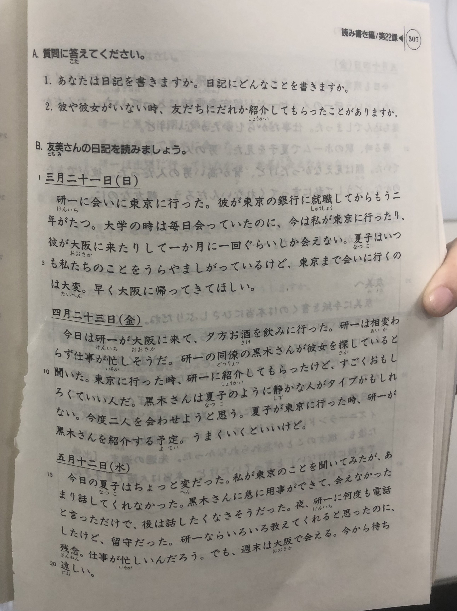

**[[ ../Menu.md | Home ]]**

友美の日記

三月二十一日(日)
研一に　会いに　東京に　行った。彼が　東京の銀行に　就職　二年がたつ。大学の時は　每日　会っていたのに、今は　私が　東京に行ったり、彼が　大阪に　来たりして　一か月に一回くらいしか　会えない。夏子は　いつも　私たちのことを　うらやましがっている　けど、東京まで　会いに行くのは　大変。早く　大阪に　帰ってきて　ほしい。

四月二十三日(金)
今日は　研一が　大阪に来て、夕方　お酒を　飲みに　行った。研一は相変らず仕事が忙しそうだ。研一の　同僚の　黑木さんが　彼女を探している　と聞いた。東京に　行った時、研一に　紹介して　もらった　けど　すごく　おもしろくて　いい人だ。黑木さんは　夏子のように　静かな人が　タイプ　かもしれない。今度　二人を　会わせ　ようと思う。夏子が　東京に　行った時、研一が　黑木さんを　紹介する予定。うまくいく　といいけど。

五月十二日(水)
今日の　夏子は　ちょっと　変だった。私が　東京のことを　聞いてみたが、あまり　話して　くれなかった。黑木さんに　急に　用事ができて　会えなかった　と言った　だけで、後は　話したく　なさそう　だった。夜、研一に　何度も電話した　けど、留守だった。研一なら　いろいろ教えて　くれる　と思った　のに、残念。仕事が　忙しいん　だろう。でも、週末は　大阪で　会える。今から　待ち遠しい。

五月十四日(金)
今日も　残業で　疲れた。それに　「急に　出張が　入って　大阪に　行けなくなった」という　研一の　メッセージが　留守番電話に　入っていた。なんだか　落ち込んで　しまった。仕事だから　しかたが　ないけど。
帰る時、駅のホームで　夏子を　見た。男の人と　一緒に　楽しそうに　話していた。顔は　見えなかった　けど、背が　高い男の人だった。彼が　できたのかな。どうして　私に　言ってくれないん　だろう。親友なのに。

五月二十二日(土)
今日　研一から　手紙が来た。……
友美へ
友美に　手紙を　書くのは　本当に　ひさしぶりだね。ぼくは　友美に　うそを　ついていた。ずっと　言わなくちゃ　いけない　と思って　いたんだ　けど、勇気が　なくて　今まで　逃げていた。うまく　説明できると　いいんだが……。夏子さんが　東京に　来た時、黒木は　急に　用事ができて、来られなくなって　しまった。それで、ぼくが　代わりに　二日間　東京を　案内して　あけたんだ。美術館に　行ったり、東京　デイズニーランドに　行ったり　して、楽しかった。彼女が　大阪に　帰った後　も、彼女のことが　忘れられ　なかった。先週の　週末、「出張で　大阪に　行けない」と　言っていた　けど、本当は　大阪で　夏子さんに　会っていたんだ。
