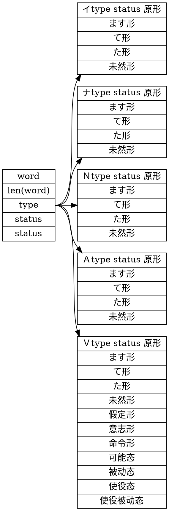

## 结构体

```graphviz
digraph Word{
    node[shape=record, charset="UTF-8"]
   // splines=ortho
    rankdir=LR

    base[label="
        word|
        len(word)|
        <type>type|
        status|
        status"
    ];

    type1[label = "イtype status
        原形|ます形|て形|た形|未然形
        "
    ];
    type2[label = "ナtype status
        原形|ます形|て形|た形|未然形
        "
    ];
    type3[label = "Ｎtype status
        原形|ます形|て形|た形|未然形
        "
    ];
    type4[label = "Ａtype status
        原形|ます形|て形|た形|未然形
        "
    ];
    type5[label = "Ｖtype status
        原形|ます形|て形|た形|未然形|假定形|意志形|命令形|可能态|被动态|使役态|使役被动态
        "
    ];

    base:type->type1
    base:type->type2
    base:type->type3
    base:type->type4
    base:type->type5

}
```